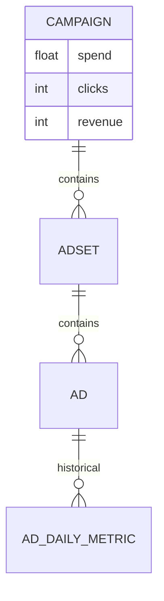
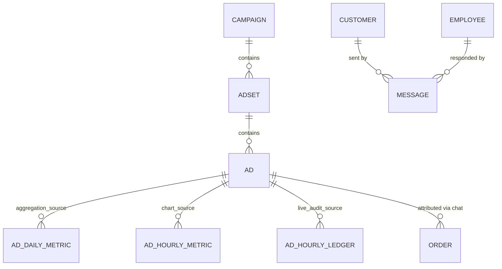

# 🏗️ CRM Migration & Architecture Handover Guide

This document provides critical architectural context and recommendations for the developer/agent maintaining the **New CRM Version** (`Freshair129/crmapp`).

## 1. Schema & Structure Comparison

### 📊 Key Column Changes
| Table | Legacy (Local Mac) | New (Supabase/GitHub) | Notes |
| :--- | :--- | :--- | :--- |
| **Employee** | `employee_code` | `employee_id` | Primary breaking change for auth logic. |
| **AdAccount** | `accountId` | `account_id` | Snake_case normalization. |
| **Campaign** | `spend`, `clicks`, `leads`, `revenue` | **Removed** | Aggregated data is now computed on-the-fly. |
| **Product** | - | `linked_menu_ids`, `fallback_category` | Added Menu-Course dependency logic. |
| **Customer** | - | `origin_id` | New source tracking. |
| **AdCreative**| - | `creative_id` | Improved creative intelligence. |

### 🔄 Architectural Structure Comparison

| Feature | Legacy Architecture (Static) | New Architecture (Bottom-Up) |
| :--- | :--- | :--- |
| **Data Storage** | Totals stored in Campaign/AdSet tables. | Totals calculated from AdDaily/Hourly metrics. |
| **Consistency** | Risk of stale data if sync fails mid-way. | High data integrity (Single source of truth). |
| **Granularity** | Daily only. | Hourly (via `ad_hourly_ledger`). |
| **Attribution** | Manual mapping in JSON cache. | Relation-based in SQL with nested identities. |

---

## 2. Entity Relationship Diagram (ERD) Comparison

### 🟥 Legacy ERD (Static Metrics)

### 🟩 New ERD (Direct Attribution & Hourly Ledger)

---

## 3. High-Level Logic Shift: Bottom-Up Aggregation (ADR-024)
As shown in the ERD above, the new version adopts a **Bottom-Up Aggregation** strategy for marketing metrics.
- **Old Version:** Stored `spend`, `clicks`, `leads`, `revenue` as static totals in the `Campaign` table.
- **New Version:** Removes these fields from `Campaign`.
- **Reason:** To ensure data integrity and prevent "stale" totals. Metrics should be calculated dynamically at the Application Layer by summing up data from `AdDailyMetric` or `AdHourlyMetric`.

### Recommendation for Audit:
- **Daily Reconciliation:** Implement a worker that pulls data from the **Facebook Marketing API** every 24 hours to populate `AdDailyMetric`.
- **Audit logic:** Compare the total revenue calculate from `Orders` (Attribution) vs. the `action_values` reported by Facebook. If the discrepancy is > 20%, trigger a manual audit alert.

## 4. Immediate Next Steps for the Agent:
1. **Sync Mapping:** Ensure the `identities` JSON in `Employee` is populated with the correct PSIDs discovered from the legacy Mac environment.
2. **Backfill History:** Use a custom migration script to lift `messages` and `conversations` from Local MySQL/Prisma to Supabase, mapping `employee_code` to the new `employee_id`.
3. **Verify Facebook Tokens:** Ensure `FB_ACCESS_TOKEN` has `ads_read` and `ads_management` permissions for the audit layer to function.

---
*Created by: Antigravity AI Assistant*
*Date: March 10, 2026*
