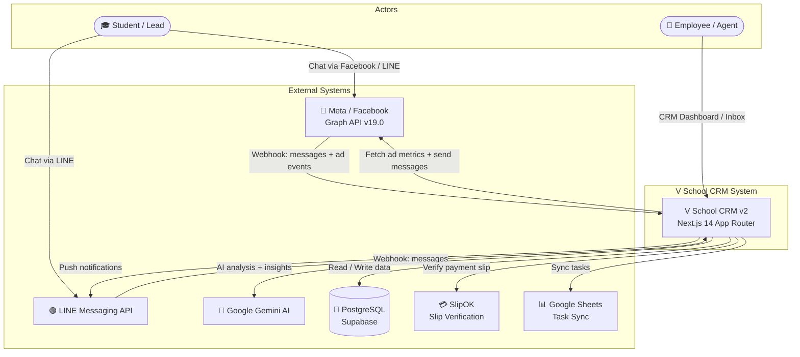
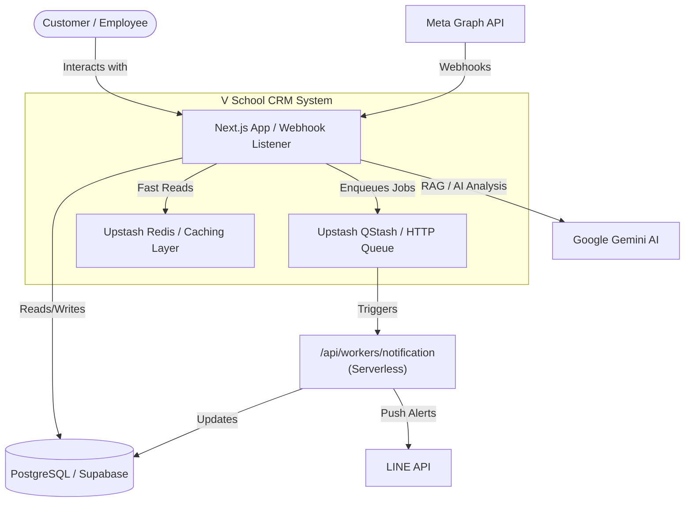
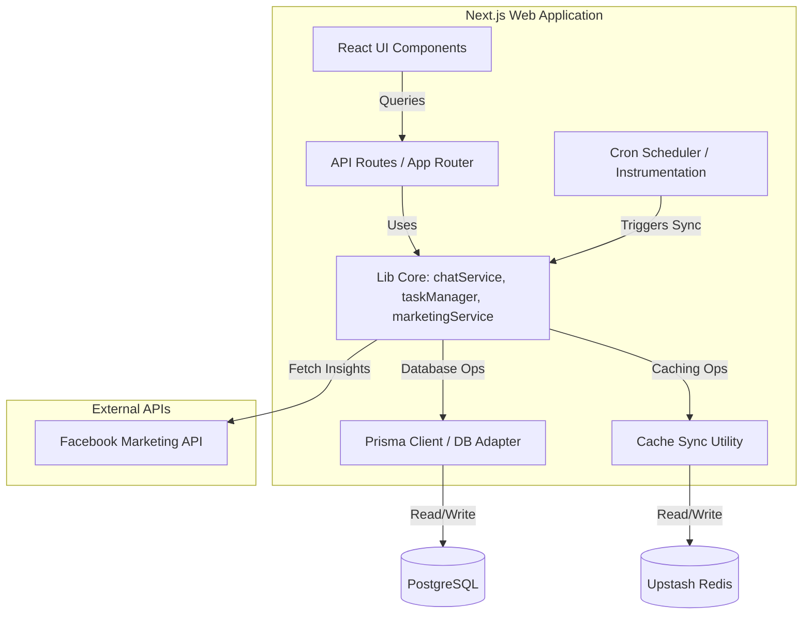
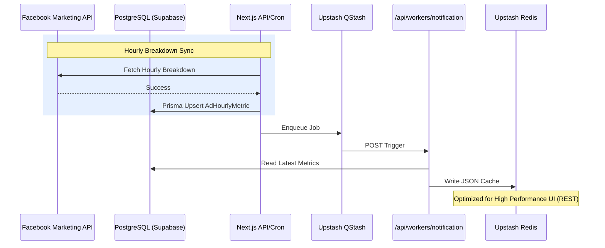
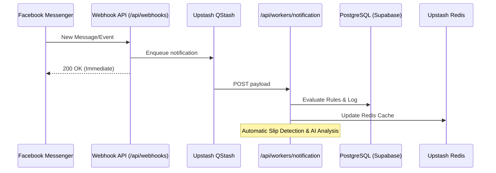
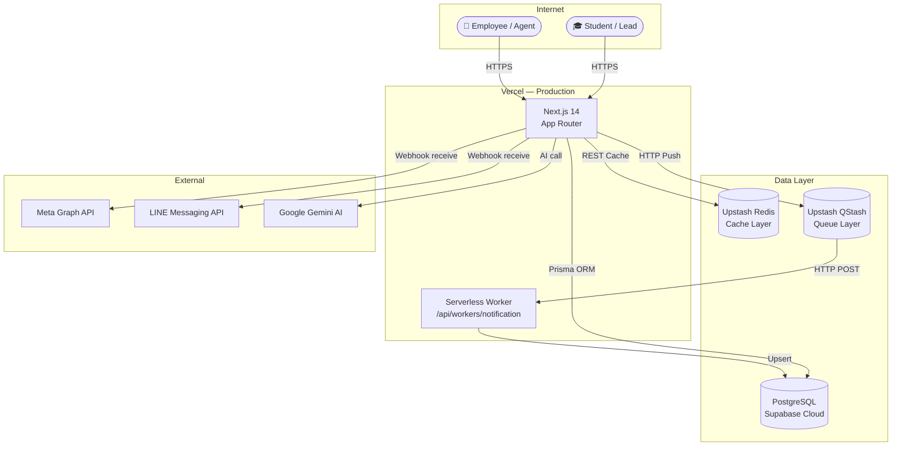

# System Architecture Documentation — V School CRM
Documentation template based on **arc42** (v8.2) and visual representations using the **C4 Model**.

---

## 1. Introduction and Goals
A comprehensive CRM system designed for V School (Japanese Culinary Academy). It provides a 360° view of customer engagement, real-time marketing analytics, and AI-driven insights to optimize business operations and student recruitment.

### Key Goals
- **Real-time Insights:** Instant visibility into marketing spend and ROAS.
- **Engagement:** Seamless integration with Facebook Messenger for student communication.
- **Scalability:** Serverless architecture to handle growing student data and complex AI workloads.

---

## 2. Architecture Constraints
- **Database:** PostgreSQL (Supabase) as the primary relational store.
- **High Performance:** Must use Redis caching for high-traffic dashboard components and heavy analytics queries.
- **AI Integration:** Google Gemini API (Vertex AI/AI Studio) for processing and insights.
- **Queueing:** Upstash QStash for serverless HTTP job queuing and retries.

---

## 3. Context and Scope
Describes the system's environment and external interfaces.

### 3.1 Business Context
The CRM interacts with students (Customers), Academy staff (Employees), and external platforms like Meta (Facebook/Messenger).

### 3.2 Technical Context (C4 Level 1 — System Context)

---

## 4. Solution Strategy
- **Serverless Platform:** Next.js for the web interface and API; QStash for background tasks.
- **Cache-First UI:** Upstash Redis (REST) caching layer to minimize database latency and API rate limits.
- **Event-Driven:** Changes in the database or external webhooks trigger serverless workers via QStash.

---

## 5. Building Block View
Detailed decomposition of the system using C4 containers and components.

### 5.1 Level 2: Containers

### 5.2 Level 3: Components (CRM Web App)

---

## 6. Runtime View
Behavior of the system during specific scenarios.

### 6.1 Marketing Data Synchronization

### 6.2 Event-Driven Chat Synchronization (Real-time)

---

## 7. Deployment View

### 7.1 Infrastructure Overview

### 7.2 Environments

| Environment | Next.js | Database | Cache | Queue |
|---|---|---|---|---|
| **Local Dev** | `npm run dev` | Docker PostgreSQL | Upstash Redis | Upstash QStash |
| **Production** | Vercel | Supabase Cloud | Upstash Redis | Upstash QStash |

### 7.3 Key NFRs for Deployment

- **NFR1:** Webhook ตอบ Meta < 200ms — ใช้ Vercel Edge proximity
- **NFR2:** Dashboard API < 500ms — Redis cache-aside ลด DB round-trips
- **NFR3:** QStash retry ≥ 5 ครั้ง, exponential backoff — built-in reliability.

---

## 8. Cross-cutting Concepts
### 8.1 Data Consistency & Caching
- **Cache-First:** API handlers use `src/lib/redis.js` to manage transient data.
- **Stale-While-Revalidate:** Immediate stale data display with background refresh.
- **Sync Logic:** Managed by `src/lib/cacheSync.js`.

### 8.2 Security & Compliance
- PDPA compliance via dedicated logging in `marketing/logs/compliance/`.
- Audit logging for all critical business actions.

---

## 9. Architecture Decisions (ADR)
Detailed history of key architectural choices:
- [ADR 001: Event-Driven Architecture](../adr/001-event-driven-architecture.md)
- [ADR 002: Hybrid Python Integration](../adr/002-hybrid-python-integration.md)
- [ADR 003: Hybrid Database Adapter](../adr/003-hybrid-database-adapter.md)
- [ADR 007: Customer ID Standardization](../adr/007-customer-id-standardization.md)
- [ADR 009: Hybrid Cache Marketing Sync](../adr/009-hybrid-cache-marketing-sync.md)
- [ADR 010: Database-First Product Catalog](../adr/010-database-first-product-catalog.md)
- [ADR 011: Custom ID Formatting](../adr/011-custom-id-formatting-and-smarter-sessioning.md)
- [ADR 012: arc42 Documentation Framework](../adr/012-arc42-documentation-framework.md)
- [ADR 013: Hourly Marketing Sync](../adr/013-hourly-marketing-sync.md)
- [ADR 014: AI-Driven Chat Automation](../adr/014-ai-driven-chat-automation.md)
- [ADR 015: Scalable Synchronization Architecture](../adr/015-scalable-sync-architecture.md)
- [ADR 030: Executive Revenue Channel Split](../adr/030-executive-revenue-channel-split.md)
- [ADR 031: Icon-only Sidebar Lucide Migration](../adr/031-icon-only-sidebar-lucide-migration.md)
- [ADR 032: UI Enhancement Recharts Framer Motion](../adr/032-ui-enhancement-recharts-framer-motion.md)
- [ADR 033: Unified Inbox Implementation](../adr/033-unified-inbox-implementation.md)
- [ADR 034: Redis Caching Layer](../adr/034-redis-caching-layer.md)
- [ADR 040: Upstash Infrastructure Migration](../adr/040-upstash-infrastructure-migration.md)

---

## 10. Quality Requirements
- **Reliability:** Background workers must handle retries for Meta Graph API rate limits.
- **Performance:** Page load for dashboards under 500ms using local cache.
- **Maintainability:** Standardized ID systems and directory structure.

---

## 11. Risks and Technical Debt
- **JSON File Size:** Large customer lists may require more optimized directory splitting (partially addressed by ID subdirectories).
- **Concurrency:** Ensure atomic writes to JSON files during high-frequency updates.

---

## 12. Glossary
- **TVS:** The V School / Thai Video Solution.
- **RAG:** Retrieval-Augmented Generation (used in knowledge base).
- **SSOT:** Single Source of Truth.
- **QStash:** Serverless HTTP-based message queue by Upstash.
