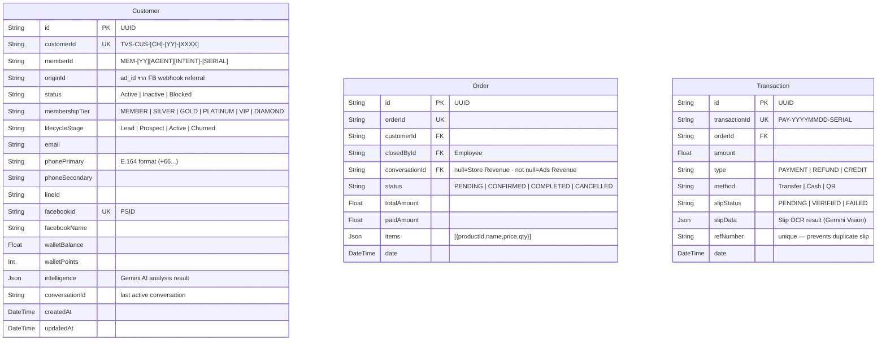
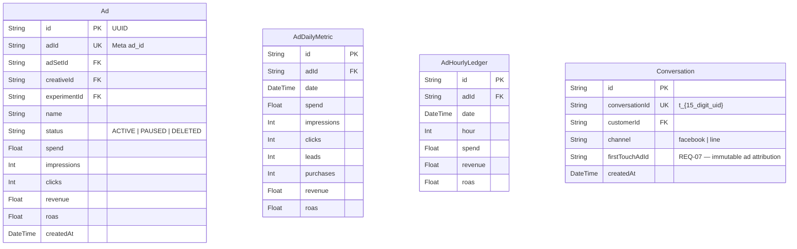
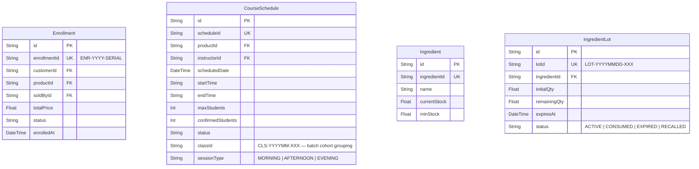
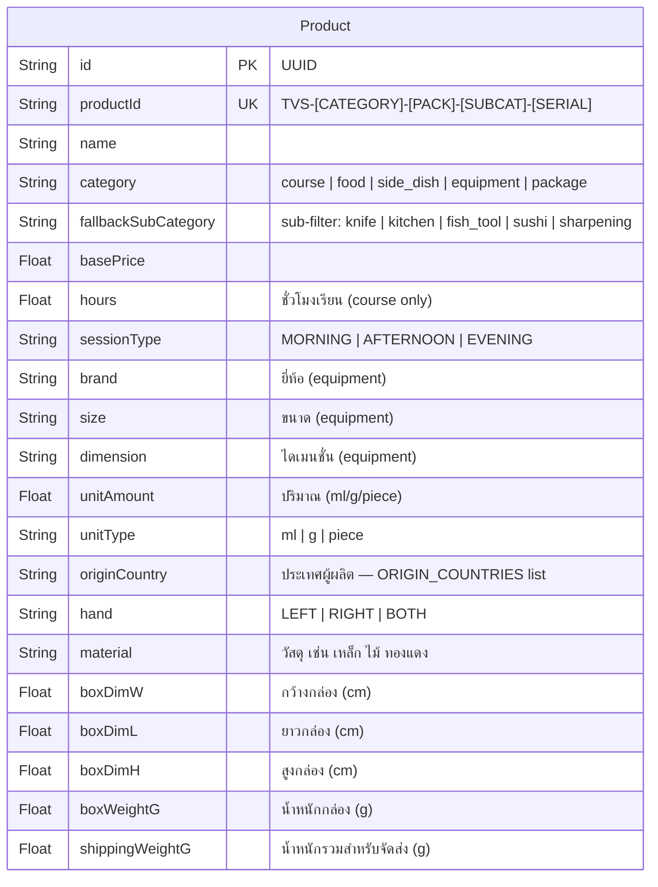
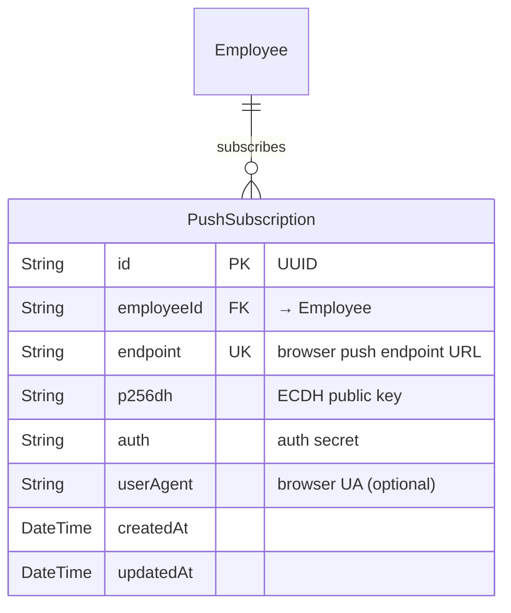

# Database Schema — Full Reference

**Last Updated:** 2026-03-21 — v1.3.0
**Reference:** `prisma/schema.prisma`
**Model Count:** 47 models

---

## 1. Entity Blocks (Detailed Fields)

### DOMAIN: Customer

### DOMAIN: Marketing / Ads

### DOMAIN: Operations & Enrollment

### DOMAIN: Product (Unified Catalog)

### DOMAIN: Web Push Notifications (ADR-044)

---

## 2. Shared Modules (Context Diagrams)

### Module 1: Sales & Marketing Core
Focus on the relationship between Customers, Ads, Conversations (firstTouchAdId), and Transactions.

### Module 2: Operations & Kitchen
Focus on the relationship between Products, Recipes, Stock Lots (FEFO), and Purchase Requests.

### Module 3: Enrollment & Packages
Focus on the hierarchy of Packages → PackageCourse → Enrollment → EnrollmentItem.

---

## 3. Key Data Flows

### Stock Deduction Flow (FEFO)
1. `CourseSchedule` COMPLETED
2. Fetch `RecipeIngredient` via `CourseBOM` (MenuBOM)
3. Deduct from `IngredientLot` (Order by `expiresAt ASC` — FEFO)
4. Log to `StockDeductionLog`
5. Update `Ingredient.currentStock`

### Chat-First Revenue Attribution Flow (Phase 26)
1. Facebook Ad Click → `Conversation.firstTouchAdId` (REQ-07, immutable)
2. ลูกค้าส่งสลิปในแชท → Gemini Vision OCR → `Transaction` (PENDING)
3. พนักงาน verify → `Transaction.slipStatus = VERIFIED`
4. `Order.paidAmount` อัปเดต
5. `analyticsRepo` aggregate: `SUM(Transaction.amount WHERE slipStatus=VERIFIED)`
6. ROAS = verified revenue / Ad.spend (ไม่ใช่ Meta estimated)

### Web Push Real-time Flow (ADR-044)
1. FB/LINE Webhook ได้รับข้อความใหม่
2. `notifyInbox()` fire-and-forget → `web-push` → Google/Mozilla Push Server
3. Service Worker (`/public/sw.js`) ได้รับ push event
4. แสดง OS notification → user click → `PUSH_NAVIGATE` postMessage
5. `UnifiedInbox.js` refetch conversations

---

## 4. Architecture Decisions (ADR Mapping)

| ADR | Decision | Model Impact |
|---|---|---|
| 024 | Bottom-Up Aggregation | `AdDailyMetric` → `Ad.roas` derivation |
| 025 | Identity Resolution | `Customer.originId`, phone E.164 |
| 028 | FB Webhook < 200ms | `Conversation` + `Message` upsert in `$transaction` |
| 030 | Revenue Channel Split | `Order.conversationId` null=Store / not null=Ads |
| 037 | Product-as-Course-Catalog | `Product.hours`, `Product.sessionType` |
| 039 | Chat-First Revenue | `Transaction.slipStatus` as truth — not Meta estimate |
| 040 | Upstash Infra | Redis/QStash — no local Docker |
| 043 | Equipment Domain POS | `Product.hand/material/boxDim*/shippingWeightG` |
| 044 | Web Push Inbox | `PushSubscription` model — ลบ SSE+polling |

---
