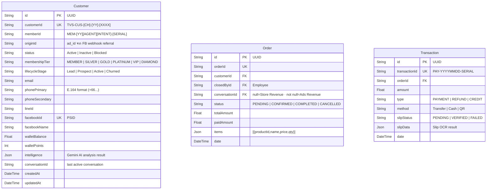
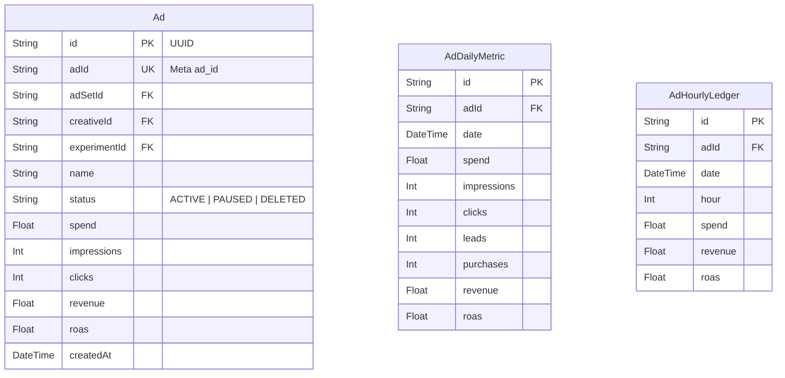
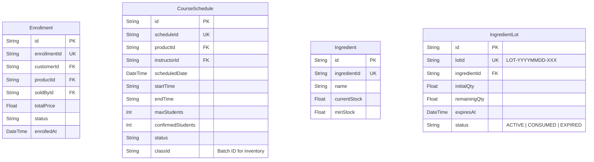

# Database Schema — Full Reference

**Last Updated:** 2026-03-19
**Reference:** `prisma/schema.prisma`

---

## 1. Entity Blocks (Detailed Fields)

### DOMAIN: Customer

### DOMAIN: Marketing / Ads

### DOMAIN: Operations & Enrollment

---

## 2. Shared Modules (Context Diagrams)

### Module 1: Sales & Marketing Core
Focus on the relationship between Customers, Ads, and Transactions.

### Module 2: Operations & Kitchen
Focus on the relationship between Products, Recipes, Stock (Lots), and PRs.

### Module 3: Enrollment & Packages
Focus on the hierarchy of Packages and Course Enrollments.

---

## 3. Key Data Flows

### Stock Deduction Flow (FEFO)
1. `CourseSchedule` COMPLETED
2. Fetch `RecipeIngredient` (MenuBOM)
3. Deduct from `IngredientLot` (Order by `expiresAt ASC`)
4. Log to `StockDeductionLog`
5. Update `Ingredient.currentStock`

### Attribution Flow
1. Facebook Ad Click
2. Webhook -> `Conversation.firstTouchAdId`
3. Sales -> `Order.conversationId`
4. Payment -> `Transaction` (Revenue)
5. Aggregate -> `Ad.revenue`

---

## 4. Architecture Decisions (ADR Mapping)

| ADR | Decision | Impact |
|---|---|---|
| 024 | Bottom-Up Aggregation | Campaign calculations derived from Ad level |
| 025 | Identity Resolution | `Customer.originId` for tracking |
| 030 | Revenue Split | `Order.conversationId` defines revenue channel |
| 039 | Chat-First Revenue | `Transaction.slipStatus` as truth |
| 040 | Upstash Infra | Redis/QStash move |

---
