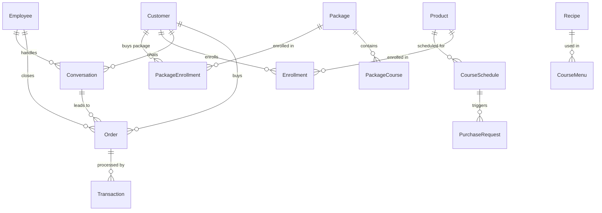

# Database ERD — High-Level Overview

**Last Updated:** 2026-03-19
**Reference:** `prisma/schema.prisma`

---

## 1. Conceptual Overview

---

## 2. Full Reference ERD (All Relationships)

```mermaid
erDiagram
    %% ═══════════════════════════════
    %% DOMAIN: Customer (Core)
    %% ═══════════════════════════════
    Customer ||--o{ Order             : "สั่งซื้อ"
    Customer ||--o{ Conversation      : "ทักแชท"
    Customer ||--o{ Task              : "มีงานติดตาม"
    Customer ||--o{ CartItem          : "มีของในตะกร้า"
    Customer ||--o{ InventoryItem     : "คอร์สที่ซื้อแล้ว"
    Customer ||--o{ TimelineEvent     : "timeline กิจกรรม"
    Customer ||--o{ Enrollment        : "ลงทะเบียนคอร์ส"
    Customer ||--o{ PackageEnrollment : "ลงทะเบียนแพ็กเกจ"

    %% ═══════════════════════════════
    %% DOMAIN: Conversation
    %% ═══════════════════════════════
    Conversation ||--o{ Message     : "มีข้อความ"
    Conversation ||--o{ ChatEpisode : "แบ่งเป็นตอน (AI)"
    Conversation ||--o{ Order       : "นำไปสู่คำสั่งซื้อ (OrderConversation)"

    %% ═══════════════════════════════
    %% DOMAIN: Employee (RBAC)
    %% ═══════════════════════════════
    Employee ||--o{ Message           : "ตอบแชท (MessageResponder)"
    Employee ||--o{ Conversation      : "รับผิดชอบ (ConversationAssignee)"
    Employee ||--o{ Order             : "ปิดการขาย (OrderCloser)"
    Employee ||--o{ Task              : "ได้รับมอบหมาย (AgentTasks)"
    Employee ||--o{ Enrollment        : "ขายคอร์ส (EnrollmentSeller)"
    Employee ||--o{ CourseSchedule    : "สอน (ScheduleInstructor)"
    Employee ||--o{ PurchaseRequest   : "อนุมัติ (PRApprover)"
    Employee ||--o{ Asset             : "รับผิดชอบอุปกรณ์ (AssetAssignee)"
    Employee ||--o{ PackageEnrollment : "ขายแพ็กเกจ (PackageEnrollmentSeller)"

    %% ═══════════════════════════════
    %% DOMAIN: Order / Sales
    %% ═══════════════════════════════
    Order ||--o{ Transaction : "มีการชำระเงิน"

    %% ═══════════════════════════════
    %% DOMAIN: Product / Cart
    %% ═══════════════════════════════
    Product ||--o{ CartItem              : "ถูกเพิ่มในตะกร้า"
    Product ||--o{ Enrollment            : "ถูกลงทะเบียน"
    Product ||--o{ EnrollmentItem        : "อยู่ใน enrollment"
    Product ||--o{ CourseSchedule        : "มีตารางสอน"
    Product ||--o{ CourseMenu            : "มีเมนูที่สอน"
    Product ||--o{ CourseEquipment       : "มีอุปกรณ์ประจำคอร์ส"
    Product ||--o{ PackageCourse         : "อยู่ใน package"
    Product ||--o{ PackageEnrollmentCourse : "ถูกเลือกใน enrollment"

    %% ═══════════════════════════════
    %% DOMAIN: Marketing / Ads (ADR-024)
    %% ═══════════════════════════════
    AdAccount ||--o{ Campaign        : "มีแคมเปญ"
    Campaign  ||--o{ AdSet           : "มีชุดโฆณา"
    AdSet     ||--o{ Ad              : "มีโฆณา"
    Ad        ||--|{ AdDailyMetric   : "สถิติรายวัน"
    Ad        ||--|{ AdHourlyMetric  : "สถิติรายชั่วโมง"
    Ad        ||--|{ AdHourlyLedger  : "append-only ledger (ADR-024 D4)"
    Ad        ||--o| AdLiveStatus    : "สถานะ live"
    Ad        }o--o| AdCreative      : "ใช้ creative"
    Ad        }o--o| Experiment      : "อยู่ใน A/B test"

    %% ═══════════════════════════════
    %% DOMAIN: Enrollment + Schedule (Phase 15)
    %% ═══════════════════════════════
    Enrollment        ||--o{ EnrollmentItem  : "มีรายการคอร์ส"
    EnrollmentItem    ||--o{ ClassAttendance : "มีประวัติเข้าเรียน"
    CourseSchedule    ||--o{ ClassAttendance : "นักเรียนเข้าเรียน session นี้"
    CourseSchedule    ||--o{ PurchaseRequest : "สร้าง PR วัตถุดิบ"

    %% ═══════════════════════════════
    %% DOMAIN: Kitchen Ops (Phase 15)
    %% ═══════════════════════════════
    Ingredient        ||--o{ PurchaseRequestItem : "ต้องสั่งซื้อ"
    Ingredient        ||--o{ RecipeIngredient    : "ใช้ใน recipe (MenuBOM)"
    PurchaseRequest   ||--o{ PurchaseRequestItem : "มีรายการสั่งซื้อ"

    %% ═══════════════════════════════
    %% DOMAIN: Recipe + Menu (Phase 16)
    %% ═══════════════════════════════
    Recipe       ||--o{ CourseMenu        : "ใช้ในคอร์ส"
    Recipe       ||--o{ RecipeIngredient  : "ใช้วัตถุดิบ (MenuBOM)"
    Recipe       ||--o{ RecipeEquipment   : "ต้องการอุปกรณ์พิเศษ"

    %% ═══════════════════════════════
    %% DOMAIN: Package (Phase 16)
    %% ═══════════════════════════════
    Package           ||--o{ PackageCourse            : "ประกอบด้วยคอร์ส"
    Package           ||--o{ PackageGift              : "มีของแถม"
    Package           ||--o{ PackageEnrollment        : "ลูกค้าลงทะเบียน"
    PackageEnrollment ||--o{ PackageEnrollmentCourse  : "เลือกคอร์สไว้"
```

---

## 3. Domain Summary

| Domain | Models | หมายเหตุ |
|---|---|---|
| Customer Core | Customer, Order, Transaction, InventoryItem, TimelineEvent, CartItem | 6 models |
| Conversation | Conversation, Message, ChatEpisode | 3 models |
| Employee / RBAC | Employee | 1 model |
| Product / Cart | Product, CartItem | 2 models |
| Marketing / Ads | AdAccount, Campaign, AdSet, Ad, AdDailyMetric, AdHourlyMetric, AdHourlyLedger, AdLiveStatus, AdCreative, Experiment | 10 models |
| Enrollment + Schedule | Enrollment, EnrollmentItem, CourseSchedule, ClassAttendance | 4 models |
| Kitchen Ops | Ingredient, IngredientLot, PurchaseRequest, PurchaseRequestItem, Asset | 5 models |
| Recipe + Menu | Recipe, CourseMenu, RecipeIngredient, RecipeEquipment | 4 models |
| Package | Package, PackageCourse, PackageGift, PackageEnrollment, PackageEnrollmentCourse | 5 models |
| Notification | NotificationRule | 1 model |
| Tasks | Task | 1 model |
| Audit | AuditLog, StockDeductionLog | 2 models |
| **Total** | **46 models** | |
