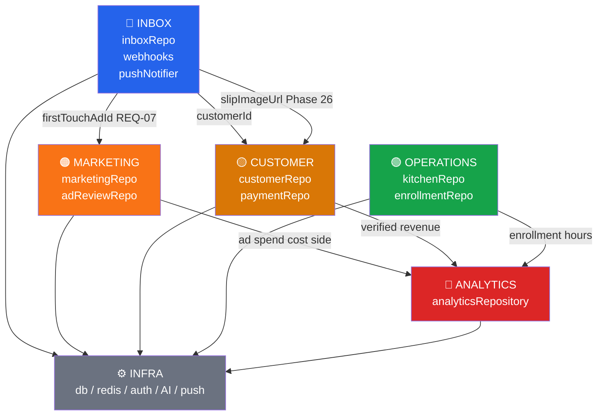
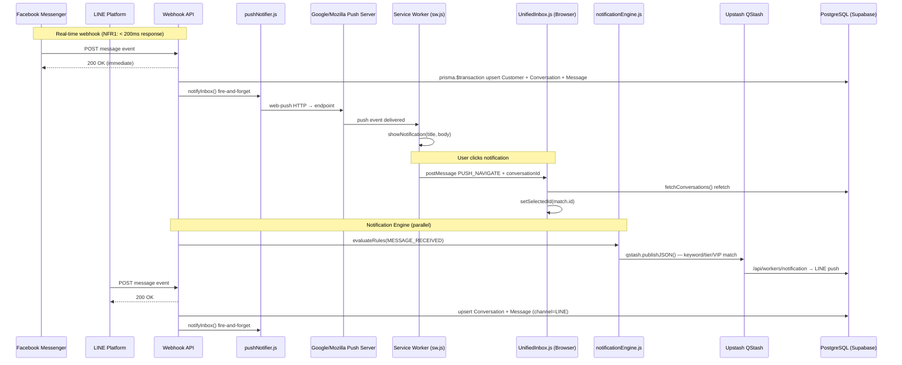
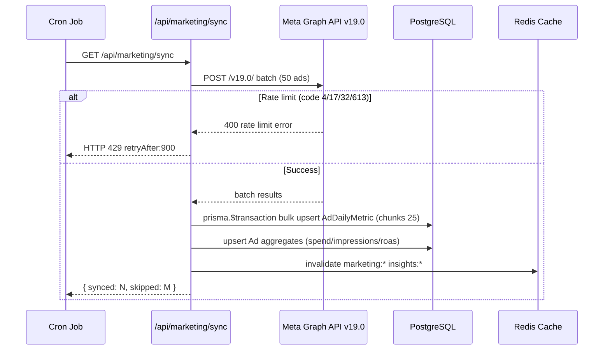
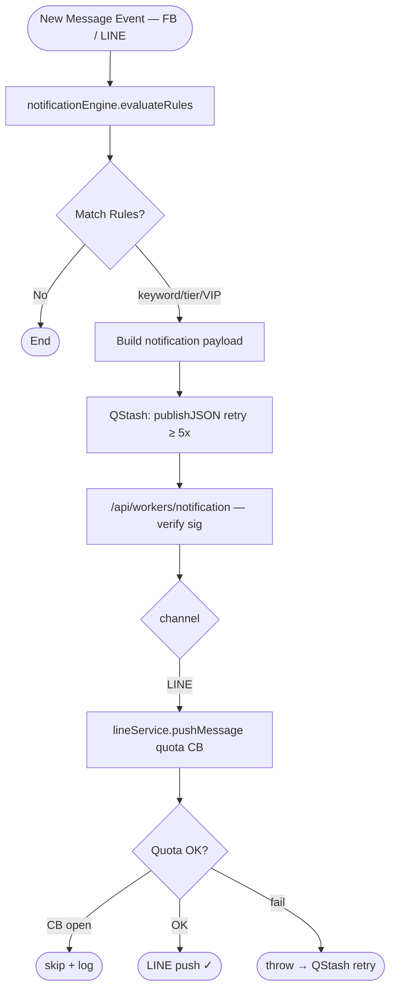
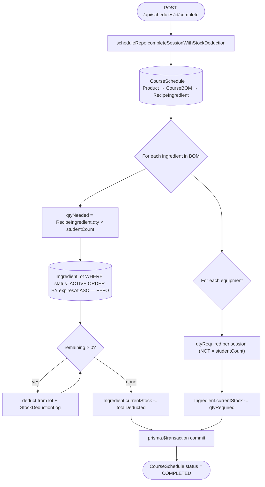
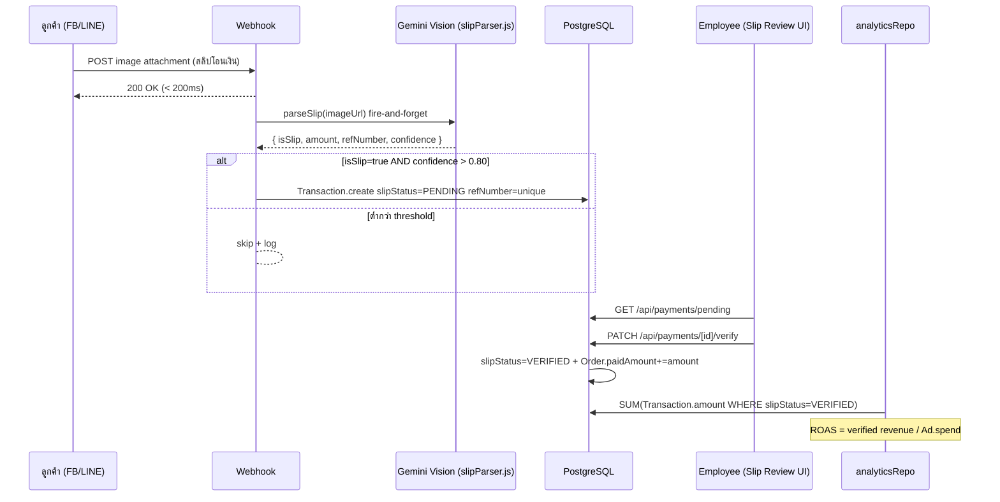
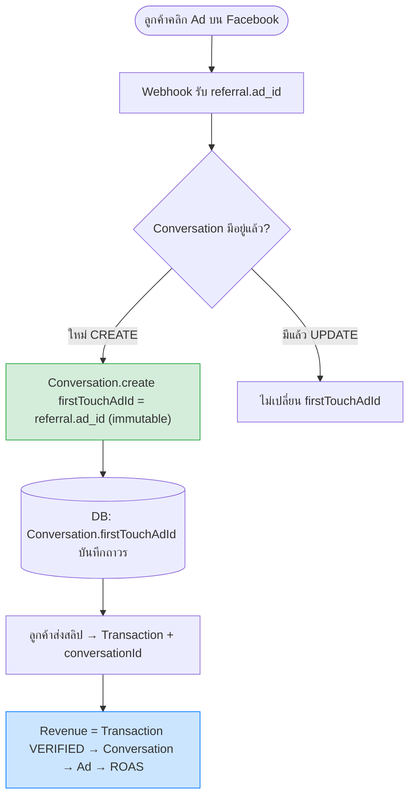

# Domain Architecture — V School CRM v2

> **Lead Architect:** Claude
> **Last updated:** 2026-03-21 — v1.3.0
> **รวมจาก:** `domain-boundaries.md` + `domain-flows.md` (ไฟล์เดิมถูก deprecated — อ่านที่นี่แทน)
> **อ่านร่วมกับ:** [`arc42-main.md`](./arc42-main.md) · [`database-erd/high-level.md`](./database-erd/high-level.md) · [`../adr/`](../adr/)

---

## ภาพรวม Domain ทั้งหมด

```
┌─────────────────────────────────────────────────────────────────────┐
│                        V School CRM v2                              │
│                                                                     │
│  ┌──────────────┐  ┌──────────────┐  ┌──────────────┐               │
│  │   INBOX      │  │  MARKETING   │  │  CUSTOMER    │               │
│  │  (แชท/DM)    │  │  (โฆษณา)     │  │  (ลูกค้า)    │               │
│  └──────┬───────┘  └──────┬───────┘  └──────┬───────┘               │
│         │                 │                 │                       │
│         └─────────────────┼─────────────────┘                       │
│                           │                                         │
│  ┌──────────────┐  ┌──────▼───────┐  ┌──────────────┐               │
│  │  OPERATIONS  │  │  ANALYTICS   │  │    INFRA     │               │
│  │ (ครัว/คอร์ส) │  │  (Dashboard) │  │ (DB/Cache/AI)│               │
│  └──────────────┘  └──────────────┘  └──────────────┘               │
└─────────────────────────────────────────────────────────────────────┘
```

---

# PART 1: Domain Boundaries & Ownership

## 1.1 🔵 INBOX DOMAIN

**หน้าที่:** รับและจัดการ conversations จาก Facebook Messenger และ LINE รวมถึง real-time notification ผ่าน Web Push

| ประเภท | รายการ |
|---|---|
| **Owns (Models)** | `Conversation`, `Message`, `ChatEpisode`, `PushSubscription` |
| **Owns (Repos)** | `inboxRepo.js` |
| **Owns (Routes)** | `/api/inbox/*`, `/api/webhooks/facebook`, `/api/webhooks/line`, `/api/push/subscribe` |
| **Owns (UI)** | `UnifiedInbox.js` |
| **Owns (Infra)** | `public/sw.js` (Service Worker), `src/lib/pushNotifier.js` |
| **ADR** | ADR-028 (FB Messaging), ADR-033 (Unified Inbox), ADR-044 (Web Push) |

**Bounded Context:**
- รู้จัก: Conversation, Message, Employee (assignee), PushSubscription
- ไม่รู้จัก: Ad spend, Recipe, Stock, Enrollment
- ส่งต่อ: `conversationId`, `customerId` ให้ domain อื่น

**Invariants (กฎที่ห้ามละเมิด):**
- Webhook ต้องตอบ < 200ms เสมอ (NFR1)
- ทุก message upsert ต้องอยู่ใน `prisma.$transaction`
- Race condition P2002 ต้อง handle ด้วย try-catch
- `notifyInbox()` ต้องเป็น fire-and-forget (ห้าม await ใน webhook handler)
- Web Push cleanup: endpoint 410/404 → ลบ PushSubscription อัตโนมัติ

---

## 1.2 🟠 MARKETING DOMAIN

**หน้าที่:** ดึงข้อมูล Meta Ads, คำนวณ ROAS, Ad Review

| ประเภท | รายการ |
|---|---|
| **Owns (Models)** | `Ad`, `AdSet`, `Campaign`, `AdDailyMetric`, `AdHourlyMetric`, `AdHourlyLedger`, `AdReviewResult`, `AdCreative` |
| **Owns (Repos)** | `marketingRepo.js`, `adReviewRepo.js`, `agentSyncRepo.js` |
| **Owns (Routes)** | `/api/marketing/*` |
| **Owns (Scripts)** | `sync-meta-ads.mjs`, `sync_agents_v5.js` |
| **Owns (UI)** | `ExecutiveAnalytics.js`, `Analytics.js` |
| **ADR** | ADR-024 (Marketing Intelligence Pipeline) |

**Bounded Context:**
- รู้จัก: Ad hierarchy (Campaign → AdSet → Ad), spend, impressions, ROAS
- ไม่รู้จัก: Kitchen stock, Enrollment, Asset
- รับจาก: `conversationId.firstTouchAdId` (REQ-07) เพื่อ attribution

**Invariants:**
- Rate limit codes 4/17/32/613 → fail-fast HTTP 429 ทันที
- AdDailyMetric upsert ต้องทำใน transaction (idempotent)
- ห้ามเรียก Prisma โดยตรงจาก route — ต้องผ่าน `marketingRepo.js`

---

## 1.3 🟡 CUSTOMER DOMAIN

**หน้าที่:** Identity resolution, Order, Transaction, Revenue (source of truth)

| ประเภท | รายการ |
|---|---|
| **Owns (Models)** | `Customer`, `Order`, `Transaction`, `InventoryItem`, `TimelineEvent` |
| **Owns (Repos)** | `customerRepo.js`, `employeeRepo.js`, `paymentRepo.js` |
| **Owns (Routes)** | `/api/customers/*`, `/api/orders/*`, `/api/payments/*` |
| **Owns (UI)** | Customer card panel ใน `UnifiedInbox.js`, `PremiumPOS.js` |
| **ADR** | ADR-025 (Identity Resolution), ADR-030 (Revenue Channel Split), ADR-039 (Chat-First Revenue) |

**Bounded Context:**
- รู้จัก: Customer identity (phone E.164, FB PSID, LINE UID), Orders, Payments
- ไม่รู้จัก: Ad creative, Marketing spend, Kitchen stock
- ส่งต่อ: `customerId`, `totalRevenue` ให้ Analytics domain

**Invariants:**
- Identity upsert ต้องอยู่ใน `prisma.$transaction` (NFR5)
- Phone ต้องเป็น E.164 format เสมอ (`normalizePhone()`)
- Customer ID format: `TVS-CUS-[CH]-[YY]-[XXXX]`
- `Transaction.slipStatus: PENDING → VERIFIED` → ถึงจะนับเป็น Revenue
- refNumber unique constraint — ป้องกันสลิปซ้ำ (Phase 26)

---

## 1.4 🟢 OPERATIONS DOMAIN

**หน้าที่:** Course enrollment, Kitchen stock (FEFO), Asset management, Schedule, Recipe, Package

| ประเภท | รายการ |
|---|---|
| **Owns (Models)** | `Enrollment`, `EnrollmentItem`, `CourseSchedule`, `Ingredient`, `IngredientLot`, `CourseBOM`, `Recipe`, `RecipeIngredient`, `RecipeEquipment`, `Package`, `Asset`, `StockDeductionLog`, `PurchaseRequest` |
| **Owns (Repos)** | `enrollmentRepo.js`, `kitchenRepo.js`, `scheduleRepo.js`, `recipeRepo.js`, `packageRepo.js`, `assetRepo.js`, `courseRepo.js` |
| **Owns (Routes)** | `/api/enrollments/*`, `/api/schedules/*`, `/api/kitchen/*`, `/api/assets/*`, `/api/recipes/*`, `/api/packages/*` |
| **Owns (UI)** | `CourseEnrollmentPanel.js`, `KitchenStockPanel.js`, `AssetPanel.js`, `ScheduleCalendar.js`, `RecipePage.js`, `PackagePage.js`, `PremiumPOS.js` |
| **ADR** | ADR-037 (Product-as-Course-Catalog), ADR-042 (Product ID Generation), ADR-043 (Equipment Domain POS) |

**Bounded Context:**
- รู้จัก: Stock Lots, BOM, Schedules, Enrollments, Assets, Equipment specs
- ไม่รู้จัก: Ad campaigns, Chat conversations, Payment slips
- ส่งต่อ: `hoursCompleted`, `certLevel` ให้ Customer domain

**Invariants:**
- Stock deduction ต้องเป็น FEFO (First Expired First Out)
- `completeSessionWithStockDeduction()` ต้องอยู่ใน `prisma.$transaction`
- `IngredientLot.remainingQty` + `Ingredient.currentStock` ต้องอัปเดตพร้อมกันเสมอ
- Package swap: ใช้ได้ 1 ครั้ง/enrollment (409 ถ้า `swapUsedAt != null`)
- Equipment sub-cat filter: ใช้ `fallbackSubCategory` ไม่ใช่ `category`

---

## 1.5 🔴 ANALYTICS DOMAIN

**หน้าที่:** รวบรวม KPI จากทุก domain มาแสดงใน Dashboard — read-only aggregation

| ประเภท | รายการ |
|---|---|
| **Owns (Models)** | ไม่มี model เป็นของตัวเอง — อ่านข้อมูลจาก domain อื่น |
| **Owns (Repos)** | `analyticsRepository.js` |
| **Owns (Routes)** | `/api/analytics/*`, `/api/executive/*` |
| **Owns (UI)** | `ExecutiveAnalytics.js`, `Dashboard.js` |
| **ADR** | ADR-024 (Bottom-Up Aggregation) |

**Invariants:**
- Revenue source of truth = `Transaction.amount WHERE slipStatus=VERIFIED` (Phase 26) ✅
- ห้ามใช้ Meta's estimated revenue เป็น primary metric
- Cache TTL: `analytics:team` = 3600s, `insights` = 3600s

---

## 1.6 ⚙️ INFRA DOMAIN

**หน้าที่:** Database, Cache, Authentication, AI services, Queue, Push Notifications

| ประเภท | รายการ |
|---|---|
| **Owns** | `src/lib/db.ts`, `src/lib/redis.js`, `src/lib/logger.js`, `src/middleware.js` |
| **AI Services** | `src/lib/geminiReviewService.js`, `src/lib/slipParser.js` |
| **Queue** | Upstash QStash + `/api/workers/notification` (serverless) — ADR-040 |
| **Cache** | Upstash Redis REST (`@upstash/redis`) — ADR-040 |
| **Push** | `web-push` npm package, VAPID keys, `pushNotifier.js` — ADR-044 |
| **Auth** | NextAuth.js, RBAC (`src/lib/rbac.js`, `src/lib/authGuard.js`) |
| **ADR** | ADR-026 (RBAC), ADR-034 (Redis Caching), ADR-040 (Upstash Migration) |

---

## 1.7 Inter-Domain Dependency Map



**กฎ Anti-Corruption:**
- ทุก domain คุยกันผ่าน **Repository Layer** เท่านั้น
- ห้าม domain A import Prisma model ของ domain B โดยตรง
- ห้าม import `getPrisma()` ใน API routes — ต้องผ่าน repo

---

## 1.8 External System Dependencies

| External System | ใช้โดย Domain | Protocol | Rate Limit | Fallback |
|---|---|---|---|---|
| **Meta Graph API v19.0** | Marketing | REST/Batch | codes 4/17/32/613 → 429 | Redis cache (stale) |
| **LINE Messaging API** | Inbox | REST | quota circuit breaker | skip + log |
| **Google Gemini AI** | Infra (Ad Review, Slip OCR) | REST | timeout 30s | return null gracefully |
| **Supabase PostgreSQL** | Infra | Prisma ORM | connection pool | — |
| **Upstash Redis REST** | Infra (Cache) | HTTPS REST | 10k req/day free | bypass cache → DB direct |
| **Upstash QStash** | Infra (Queue) | HTTPS HTTP queue | 500 msg/day free | retry ≥ 5x built-in |
| **Google/Mozilla Push Server** | Infra (Web Push) | HTTPS (web-push) | ไม่มี limit | ถ้าไม่ได้รับ → ไม่มี real-time |
| **Google Sheets** | Operations | CSV URL | — | warn + skip |

---

## 1.9 What Each Domain Can Change Independently

| Domain | เปลี่ยนได้โดยไม่กระทบ domain อื่น | ต้องประสานงานก่อนเปลี่ยน |
|---|---|---|
| **INBOX** | Webhook parsing logic, UI layout, push notification content | Schema Conversation (กระทบ MARKETING REQ-07) |
| **MARKETING** | Ad Review rules, sync schedule, cache keys | Revenue calculation method (กระทบ ANALYTICS) |
| **CUSTOMER** | Phone normalize logic, ID format | Transaction model (กระทบ ANALYTICS revenue) |
| **OPERATIONS** | FEFO logic, BOM structure, asset categories, equipment fields | ไม่มี downstream ที่ critical |
| **ANALYTICS** | UI charts, timeframe labels, KPI formulas | Revenue source switch (กระทบ Dashboard accuracy) |
| **INFRA** | Redis TTL, Logger format, connection pool, VAPID keys | Auth/RBAC rules (กระทบทุก domain) |

---

## 1.10 Bounded Context Anti-Patterns (ห้ามทำ)

| Anti-Pattern | ตัวอย่าง | ทำไมห้าม |
|---|---|---|
| Cross-domain Prisma | `marketingRepo.js` query `Customer` table โดยตรง | ละเมิด boundary — ใช้ `customerRepo` แทน |
| Shared mutable state | 2 domains อัปเดต `Ingredient.currentStock` พร้อมกัน | Race condition — ต้องผ่าน `kitchenRepo` เท่านั้น |
| Direct API call bypass | Route เรียก `getPrisma()` โดยไม่ผ่าน repo | Phase 22 แก้แล้ว — ห้ามทำซ้ำ |
| Revenue จาก Meta estimate | `analyticsRepository` ใช้ `AdDailyMetric.revenue` เป็น truth | Meta ประมาณเอง ไม่ใช่เงินจริง — Phase 26 แก้แล้ว |
| Webhook business logic | Webhook route มี if/else ซับซ้อน > 20 บรรทัด | ย้ายไป service/repo layer |
| Await push ใน webhook | `await notifyInbox()` ใน webhook handler | บล็อก 200ms response — ต้อง fire-and-forget |

---

## 1.11 Repository Layer — Anti-Corruption Layer

```
[API Route / Webhook]
        │
        │ import { fn } from '@/lib/repositories/xxxRepo'
        ▼
[Repository Layer]  ← boundary ที่ enforce domain isolation
        │
        │ getPrisma() → prisma.model.operation()
        ▼
[Prisma ORM → PostgreSQL]
```

---

# PART 2: Domain Data Flow Diagrams

## 2.1 Inbox — Real-time Web Push Flow (v1.3.0)



---

## 2.2 Marketing Sync Pipeline — Meta Ads → DB → Cache



---

## 2.3 Notification Rule Engine → QStash → LINE Push



---

## 2.4 Kitchen Stock Deduction — FEFO Lot Deduction



---

## 2.5 Chat-First Revenue Attribution — Slip OCR → Transaction → ROAS



---

## 2.6 REQ-07: First Touch Ad Attribution



---

## 2.7 Cross-Domain: Redis Cache Strategy

```mermaid
flowchart LR
    subgraph "API Routes"
        A[/api/marketing/insights]
        B[/api/inbox/conversations]
        C[/api/analytics/team]
    end
    subgraph "Redis getOrSet"
        R[("Upstash Redis REST")]
    end
    subgraph "PostgreSQL"
        DB[("Supabase")]
    end

    A -->|"key: insights:TIMEFRAME TTL:3600s"| R
    B -->|"key: inbox:list:PAGE TTL:60s"| R
    C -->|"key: analytics:team:DATE TTL:3600s"| R
    R -->|MISS: query| DB
    DB -->|write-through| R

    style R fill:#dc2626,color:#fff
    style DB fill:#2563eb,color:#fff
```

---

# PART 3: Boundary Version History

| Version | การเปลี่ยน Boundary | เหตุผล |
|---|---|---|
| v0.21.0 | สร้าง `inboxRepo.js` + ย้าย inbox logic | Phase 17 — repo compliance |
| v0.21.0 | `marketingRepo.js` เพิ่ม aggregation | Phase 17 — repo compliance |
| v0.23.0 | Marketing + Inbox routes ไม่มี direct Prisma | Phase 22 — full compliance ✅ |
| v0.25.0 | RBAC enforce ทุก domain | Phase 14b — BKL-04 resolved ✅ |
| v0.26.0 | Customer domain owns Revenue (paymentRepo + slipParser) | Phase 26 — Chat-First Revenue ✅ |
| v0.26.0 | Analytics เปลี่ยน revenue source → Transaction VERIFIED | Phase 26 — ไม่ใช้ Meta estimate ✅ |
| v0.27.0 | INFRA Queue: BullMQ → Upstash QStash | ADR-040 — zero local infra ✅ |
| v0.27.0 | INFRA Cache: ioredis → Upstash Redis REST | ADR-040 — zero local infra ✅ |
| v1.2.0 | OPERATIONS: equipment spec fields (hand/material/specs) | ADR-043 — Equipment Domain POS ✅ |
| v1.3.0 | INBOX: ลบ SSE+polling → Web Push VAPID | ADR-044 — Zero Polling ✅ |
| v1.3.0 | INFRA: เพิ่ม pushNotifier.js + web-push | ADR-044 ✅ |

---

*ไฟล์นี้รวม `domain-boundaries.md` + `domain-flows.md` เข้าด้วยกัน (deprecated ตั้งแต่ v1.3.0)*
*อ่านเพิ่มเติม: [`arc42-main.md`](./arc42-main.md) · [`database-erd/`](./database-erd/) · [`../adr/`](../adr/)*
