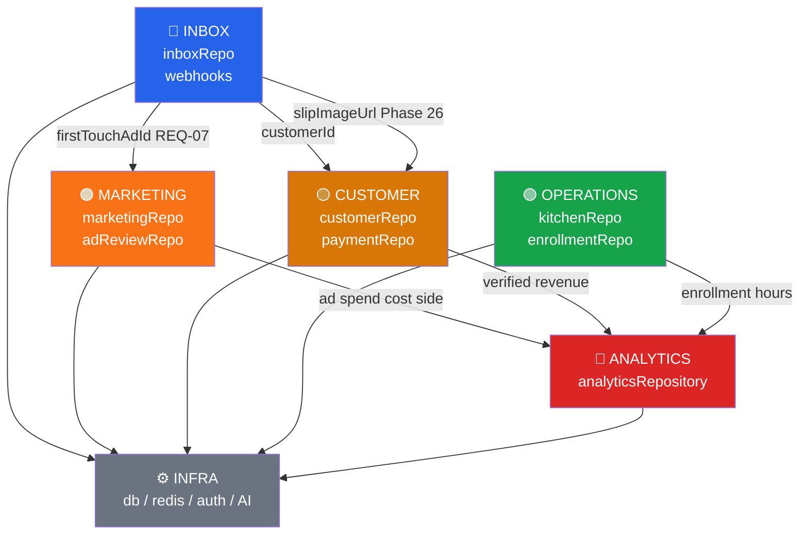

# Domain Boundaries & Dependency Map — V School CRM v2

> ⚠️ **DEPRECATED (v1.3.0)** — ไฟล์นี้ถูกรวมเข้ากับ [`domain-architecture.md`](./domain-architecture.md) แล้ว
> อ่านเอกสารล่าสุดที่ **`domain-architecture.md`** แทนไฟล์นี้

> **Lead Architect:** Claude
> **Last updated:** 2026-03-19 — v1.1.0 (superseded by domain-architecture.md v1.3.0)
> อ่านร่วมกับ [`domain-flows.md`](./domain-flows.md) · [`arc42-main.md`](./arc42-main.md)

---

## ภาพรวม Domain ทั้งหมด

```
┌─────────────────────────────────────────────────────────────────────┐
│                        V School CRM v2                              │
│                                                                     │
│  ┌──────────────┐  ┌──────────────┐  ┌──────────────┐               │
│  │   INBOX      │  │  MARKETING   │  │  CUSTOMER    │               │
│  │  (แชท/DM)    │  │  (โฆษณา)     │  │  (ลูกค้า)      │               │
│  └──────┬───────┘  └──────┬───────┘  └──────┬───────┘               │
│         │                 │                 │                       │
│         └─────────────────┼─────────────────┘                       │
│                           │                                         │
│  ┌──────────────┐  ┌──────▼───────┐  ┌──────────────┐               │
│  │  OPERATIONS  │  │  ANALYTICS   │  │    INFRA     │               │
│  │ (ครัว/คอร์ส)   │  │  (Dashboard) │  │ (DB/Cache/AI)│               │
│  └──────────────┘  └──────────────┘  └──────────────┘               │
└─────────────────────────────────────────────────────────────────────┘
```

---

## 1. Domain Definitions & Ownership

### 🔵 INBOX DOMAIN
**หน้าที่:** รับและจัดการ conversations จาก Facebook Messenger และ LINE

| ประเภท | รายการ |
|---|---|
| **Owns (Models)** | `Conversation`, `Message`, `ChatEpisode` |
| **Owns (Repos)** | `inboxRepo.js` |
| **Owns (Routes)** | `/api/inbox/*`, `/api/webhooks/facebook`, `/api/webhooks/line` |
| **Owns (UI)** | `UnifiedInbox.js` |
| **ADR** | ADR-028 (FB Messaging), ADR-033 (Unified Inbox) |

**Bounded Context:**
- รู้จัก: Conversation, Message, Employee (assignee)
- ไม่รู้จัก: Ad spend, Recipe, Stock, Enrollment
- ส่งต่อ: `conversationId`, `customerId` ให้ domain อื่น

**Invariants (กฎที่ห้ามละเมิด):**
- Webhook ต้องตอบ < 200ms เสมอ (NFR1)
- ทุก message upsert ต้องอยู่ใน `prisma.$transaction`
- Race condition P2002 ต้อง handle ด้วย try-catch

---

### 🟠 MARKETING DOMAIN
**หน้าที่:** ดึงข้อมูล Meta Ads, คำนวณ ROAS, Ad Review

| ประเภท | รายการ |
|---|---|
| **Owns (Models)** | `Ad`, `AdSet`, `Campaign`, `AdDailyMetric`, `AdHourlyMetric`, `AdHourlyLedger`, `AdReviewResult`, `AdCreative` |
| **Owns (Repos)** | `marketingRepo.js`, `adReviewRepo.js`, `agentSyncRepo.js` |
| **Owns (Routes)** | `/api/marketing/*` |
| **Owns (Scripts)** | `sync-meta-ads.mjs`, `sync_agents_v5.js` |
| **Owns (UI)** | `ExecutiveAnalytics.js`, `Analytics.js` |
| **ADR** | ADR-024 (Marketing Intelligence Pipeline) |

**Bounded Context:**
- รู้จัก: Ad hierarchy (Campaign → AdSet → Ad), spend, impressions, ROAS
- ไม่รู้จัก: Kitchen stock, Enrollment, Asset
- รับจาก: `conversationId.firstTouchAdId` (REQ-07) เพื่อ attribution

**Invariants:**
- Rate limit codes 4/17/32/613 → fail-fast HTTP 429 ทันที
- AdDailyMetric upsert ต้องทำใน transaction (idempotent)
- ห้ามเรียก Prisma โดยตรงจาก route — ต้องผ่าน `marketingRepo.js`

---

### 🟡 CUSTOMER DOMAIN
**หน้าที่:** Identity resolution, Order, Transaction, Revenue (source of truth)

| ประเภท | รายการ |
|---|---|
| **Owns (Models)** | `Customer`, `Order`, `Transaction`, `InventoryItem`, `TimelineEvent` |
| **Owns (Repos)** | `customerRepo.js`, `employeeRepo.js` |
| **Owns (Routes)** | `/api/customers/*`, `/api/orders/*`, `/api/payments/*` |
| **Owns (UI)** | Customer card panel ใน `UnifiedInbox.js`, `PremiumPOS.js` |
| **ADR** | ADR-025 (Identity Resolution), ADR-030 (Revenue Channel Split) |

**Bounded Context:**
- รู้จัก: Customer identity (phone E.164, FB PSID, LINE UID), Orders, Payments
- ไม่รู้จัก: Ad creative, Marketing spend, Kitchen stock
- ส่งต่อ: `customerId`, `totalRevenue` ให้ Analytics domain

**Invariants:**
- Identity upsert ต้องอยู่ใน `prisma.$transaction` (NFR5)
- Phone ต้องเป็น E.164 format เสมอ (`normalizePhone()`)
- Customer ID format: `TVS-CUS-[CH]-[YY]-[XXXX]`
- Transaction.slipStatus: PENDING → VERIFIED → ถึงจะนับเป็น Revenue

---

### 🟢 OPERATIONS DOMAIN
**หน้าที่:** Course enrollment, Kitchen stock, Asset management, Schedule

| ประเภท | รายการ |
|---|---|
| **Owns (Models)** | `Enrollment`, `EnrollmentItem`, `CourseSchedule`, `Ingredient`, `IngredientLot`, `CourseBOM`, `Recipe`, `RecipeIngredient`, `RecipeEquipment`, `Package`, `Asset`, `StockDeductionLog`, `PurchaseRequest` |
| **Owns (Repos)** | `enrollmentRepo.js`, `kitchenRepo.js`, `scheduleRepo.js`, `recipeRepo.js`, `packageRepo.js`, `assetRepo.js`, `courseRepo.js` |
| **Owns (Routes)** | `/api/enrollments/*`, `/api/schedules/*`, `/api/kitchen/*`, `/api/assets/*`, `/api/recipes/*`, `/api/packages/*`, `/api/products/[id]/stats` |
| **Owns (UI)** | `CourseEnrollmentPanel.js`, `KitchenStockPanel.js`, `AssetPanel.js`, `ScheduleCalendar.js`, `RecipePage.js`, `PackagePage.js`, `PremiumPOS.js` (ProductDetailModal + stats) |
| **ADR** | ADR-037 (Product-as-Course-Catalog), ADR-042 (Product ID Generation from Sheets) |

**Bounded Context:**
- รู้จัก: Stock, Lots, BOM, Schedules, Enrollments, Assets
- ไม่รู้จัก: Ad campaigns, Chat conversations, Payment slips
- ส่งต่อ: `hoursCompleted`, `certLevel` ให้ Customer domain

**Invariants:**
- Stock deduction ต้องเป็น FEFO (First Expired First Out)
- `completeSessionWithStockDeduction()` ต้องอยู่ใน `prisma.$transaction`
- Lot.remainingQty + Ingredient.currentStock ต้องอัปเดตพร้อมกันเสมอ
- Package swap: ใช้ได้ 1 ครั้ง/enrollment (409 ถ้า swapUsedAt != null)

---

### 🔴 ANALYTICS DOMAIN
**หน้าที่:** รวบรวม KPI จากทุก domain มาแสดงใน Dashboard

| ประเภท | รายการ |
|---|---|
| **Owns (Models)** | ไม่มี model เป็นของตัวเอง — อ่านข้อมูลจาก domain อื่น |
| **Owns (Repos)** | `analyticsRepository.js` |
| **Owns (Routes)** | `/api/analytics/*`, `/api/executive/*` |
| **Owns (UI)** | `ExecutiveAnalytics.js`, `Dashboard.js` |
| **ADR** | ADR-024 (Bottom-Up Aggregation) |

**Bounded Context:**
- อ่านจาก: Customer (revenue), Marketing (spend/ROAS), Operations (enrollment/hours)
- ไม่เขียน: ไม่มี write operation — read-only aggregation
- Output: KPI รายเดือน, ROAS จริง, Team performance

**Invariants:**
- Revenue source of truth = `Transaction.amount WHERE slipStatus=VERIFIED` (Phase 26)
- ห้ามใช้ Meta's estimated revenue เป็น primary metric
- Cache TTL: analytics:team = 3600s, insights = 3600s

---

### ⚙️ INFRA DOMAIN
**หน้าที่:** Database, Cache, Authentication, AI services, Logging

| ประเภท | รายการ |
|---|---|
| **Owns** | `src/lib/db.ts`, `src/lib/redis.js`, `src/lib/logger.js`, `src/middleware.js` |
| **AI Services** | `src/lib/geminiReviewService.js`, `src/lib/slipParser.js` |
| **Queue** | Upstash QStash + `/api/workers/notification` (serverless) — ADR-040 |
| **Cache** | Upstash Redis REST (`@upstash/redis`) — ADR-040 |
| **Auth** | NextAuth.js, RBAC (`src/lib/rbac.js`, `src/lib/authGuard.js`) |
| **ADR** | ADR-026 (RBAC), ADR-034 (Redis Caching), ADR-040 (Upstash Migration) |

**Bounded Context:**
- ให้บริการ: ทุก domain ใช้ infra — แต่ infra ไม่รู้จัก business logic
- ห้าม: ใส่ business logic ใน infra layer

---

## 2. Inter-Domain Dependency Map



**กฎ Anti-Corruption:**
- ทุก domain คุยกันผ่าน **Repository Layer** เท่านั้น
- ห้าม domain A import Prisma model ของ domain B โดยตรง
- ห้าม import `getPrisma()` ใน API routes — ต้องผ่าน repo

---

## 3. External System Dependencies

| External System | ใช้โดย Domain | Protocol | Rate Limit | Fallback |
|---|---|---|---|---|
| **Meta Graph API v19.0** | Marketing | REST/Batch | codes 4/17/32/613 → 429 | Redis cache (stale) |
| **LINE Messaging API** | Inbox | REST | quota circuit breaker | skip + log |
| **Google Gemini AI** | Infra (Ad Review, Slip OCR) | REST | timeout 30s | return null gracefully |
| **Supabase PostgreSQL** | Infra | Prisma ORM | connection pool | — |
| **Upstash Redis REST** | Infra (Cache) | HTTPS REST (@upstash/redis) | 10k req/day free tier | bypass cache → DB direct |
| **Upstash QStash** | Infra (Queue) | HTTPS HTTP queue (@upstash/qstash) | 500 msg/day free tier | retry ≥ 5x built-in |
| **Google Sheets** | Operations | CSV URL | — | warn + skip |

---

## 4. Phase 26 — Dependency Analysis (Chat-First Revenue)

```
Phase 26 Dependencies:

① Conversation.firstTouchAdId (REQ-07)
   Domain: INBOX
   Schema change: เพิ่ม field ใน Conversation
   Blocker for: Revenue attribution (ANALYTICS)
   Status: 🔲 Not done

② slipParser.js (Gemini Vision OCR)
   Domain: INFRA
   External dep: Google Gemini API (มี key แล้ว)
   Blocker for: paymentRepo.createFromSlip()
   Status: 🔲 Not done

③ paymentRepo.js
   Domain: CUSTOMER
   Depends on: ① + ②
   Uses existing: Transaction model (slipImageUrl, slipData, slipStatus ✅)
   Status: 🔲 Not done

④ Slip Review UI
   Domain: CUSTOMER / INBOX
   Depends on: ③
   Status: 🔲 Not done

⑤ Revenue Aggregation Switch
   Domain: ANALYTICS
   Depends on: ③ verified transactions exist
   Change: analyticsRepository.js → read Transaction ไม่ใช่ AdDailyMetric
   Status: 🔲 Not done
```

**Critical Path:**
```
① REQ-07 ──┐
            ├──→ ③ paymentRepo ──→ ④ UI ──→ ⑤ Revenue
② OCR ─────┘
```

**ทำพร้อมกันได้:** ① และ ② (independent กัน)

---

## 5. What Each Domain Can Change Independently

| Domain | เปลี่ยนได้โดยไม่กระทบ domain อื่น | ต้องประสานงานก่อนเปลี่ยน |
|---|---|---|
| **INBOX** | Webhook parsing logic, UI layout, cache TTL | Schema Conversation (กระทบ MARKETING REQ-07) |
| **MARKETING** | Ad Review rules, sync schedule, cache keys | Revenue calculation method (กระทบ ANALYTICS) |
| **CUSTOMER** | Phone normalize logic, ID format | Transaction model (กระทบ ANALYTICS revenue) |
| **OPERATIONS** | FEFO logic, BOM structure, asset categories | ไม่มี downstream ที่ critical |
| **ANALYTICS** | UI charts, timeframe labels, KPI formulas | Revenue source switch (กระทบ Dashboard accuracy) |
| **INFRA** | Redis TTL, Logger format, connection pool | Auth/RBAC rules (กระทบทุก domain) |

---

## 6. Bounded Context Anti-Patterns (ห้ามทำ)

| Anti-Pattern | ตัวอย่าง | ทำไมห้าม |
|---|---|---|
| Cross-domain Prisma | `marketingRepo.js` query `Customer` table โดยตรง | ละเมิด boundary — ใช้ `customerRepo` แทน |
| Shared mutable state | 2 domains อัปเดต `Ingredient.currentStock` พร้อมกัน | Race condition — ต้องผ่าน `kitchenRepo` เท่านั้น |
| Direct API call bypass | Route เรียก `getPrisma()` โดยไม่ผ่าน repo | Phase 22 แก้แล้ว — ห้ามทำซ้ำ |
| Revenue จาก Meta estimate | `analyticsRepository` ใช้ `AdDailyMetric.revenue` เป็น truth | Meta ประมาณเอง ไม่ใช่เงินจริง (Phase 26 แก้) |
| Webhook business logic | Webhook route มี if/else ซับซ้อน > 20 บรรทัด | ย้ายไป service/repo layer |

---

## 7. Repository Layer — Anti-Corruption Layer

```
[API Route / Webhook]
        │
        │ import { fn } from '@/lib/repositories/xxxRepo'
        ▼
[Repository Layer]  ← boundary ที่ enforce domain isolation
        │
        │ getPrisma() → prisma.model.operation()
        ▼
[Prisma ORM → PostgreSQL]
```

**กฎ (จาก ADR ทั้งหมด):**
- API route: import repo เท่านั้น — ห้าม import `getPrisma` โดยตรง ✅ (Phase 22 done)
- Repository: import `getPrisma` เท่านั้น — ห้าม call API/fetch
- Component: ไม่มี DB access — fetch ผ่าน API routes เท่านั้น

---

## 8. Version History ของ Boundary Decisions

| Version | การเปลี่ยน Boundary | เหตุผล |
|---|---|---|
| v0.21.0 | สร้าง `inboxRepo.js` + ย้าย inbox logic | Phase 17 — repo compliance |
| v0.21.0 | `marketingRepo.js` เพิ่ม aggregation | Phase 17 — repo compliance |
| v0.23.0 | Marketing + Inbox routes ไม่มี direct Prisma | Phase 22 — full compliance |
| v0.25.0 | RBAC enforce ทุก domain | Phase 14b — BKL-04 resolved |
| v0.26.0 | Customer domain owns Revenue (จากสลิป) — paymentRepo + slipParser | Phase 26 — Chat-First Revenue ✅ |
| v0.26.0 | Analytics เปลี่ยน revenue source → Transaction VERIFIED | Phase 26 — ไม่ใช้ Meta estimate ✅ |
| v0.27.0 | INFRA Queue: BullMQ → Upstash QStash (serverless) | ADR-040 — zero local infra ✅ |
| v0.27.0 | INFRA Cache: ioredis → Upstash Redis REST | ADR-040 — zero local infra ✅ |

---

*อ่านเพิ่มเติม:*
- [`domain-flows.md`](./domain-flows.md) — Sequence + Flowchart ของแต่ละ domain
- [`arc42-main.md`](./arc42-main.md) — Full architecture documentation
- [`../adr/`](../adr/) — Architecture Decision Records
- [`../attribution_tree.md`](../attribution_tree.md) — Sales attribution tree (Revenue flow)
- [`../../ROADMAP_TO_PRODUCTION.md`](../../ROADMAP_TO_PRODUCTION.md) — Remaining phases to v1.0.0
