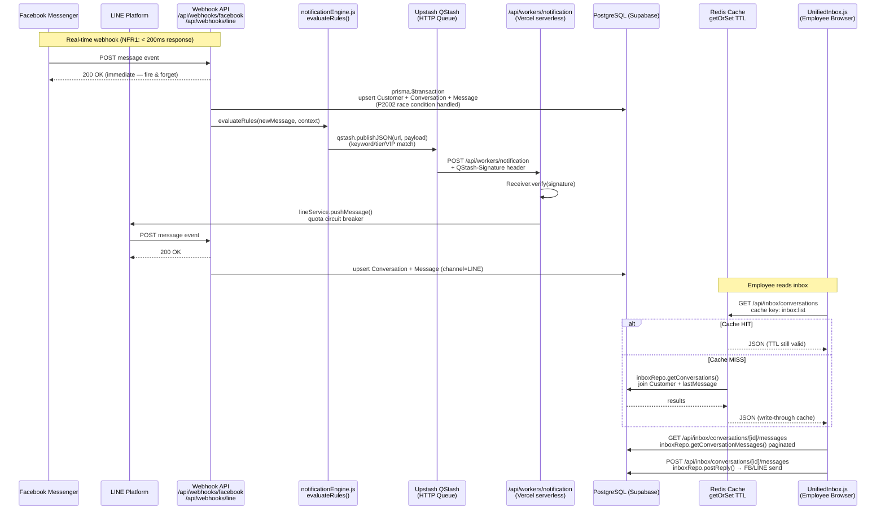
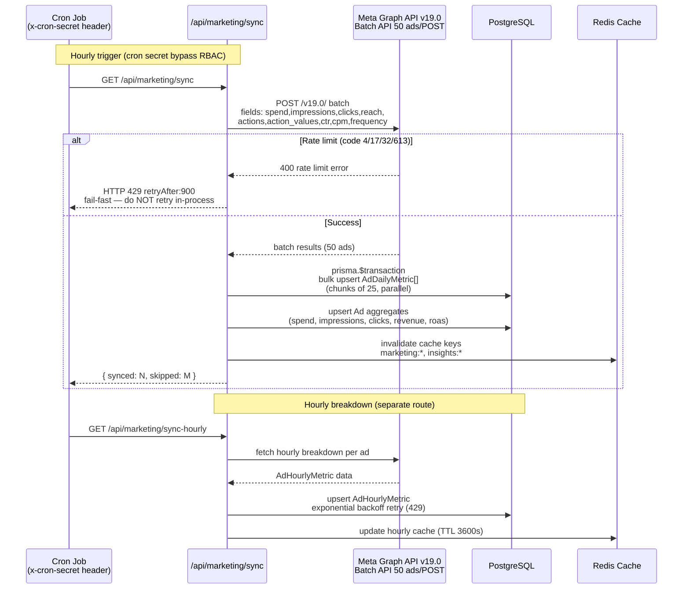
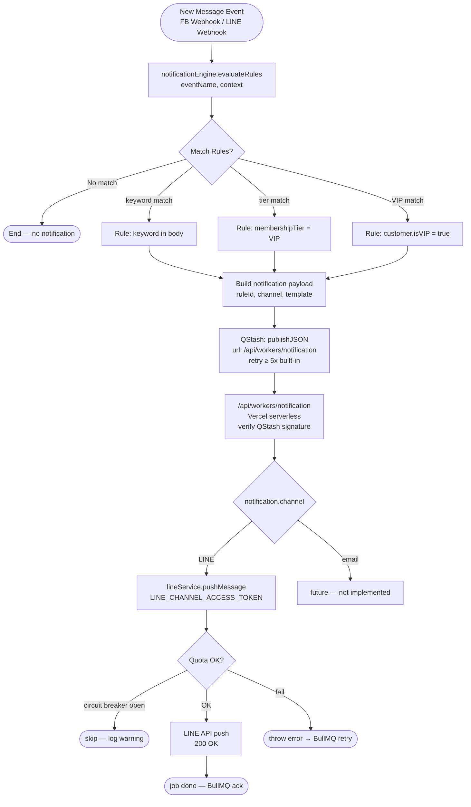
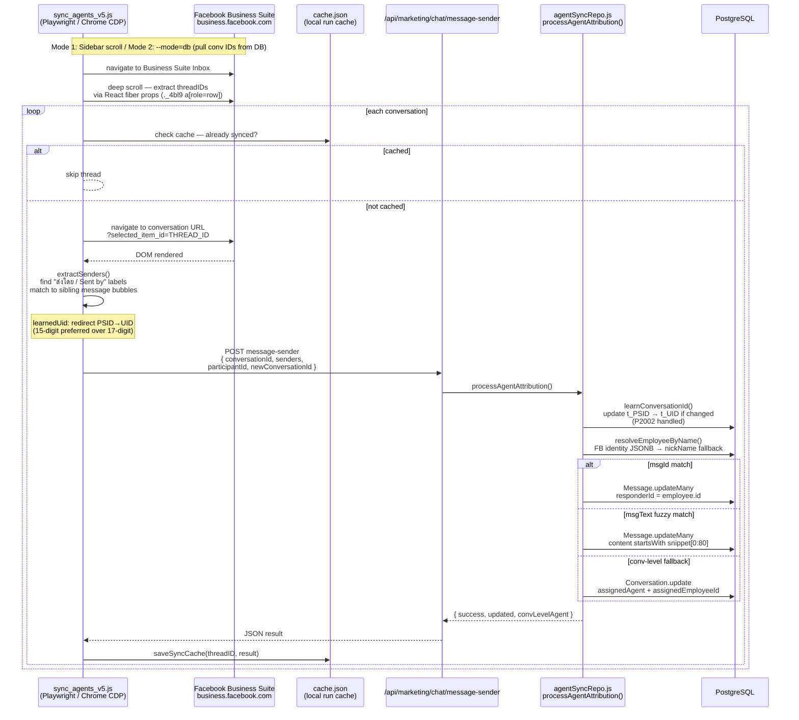
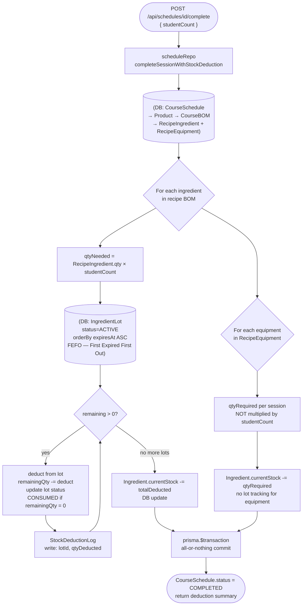
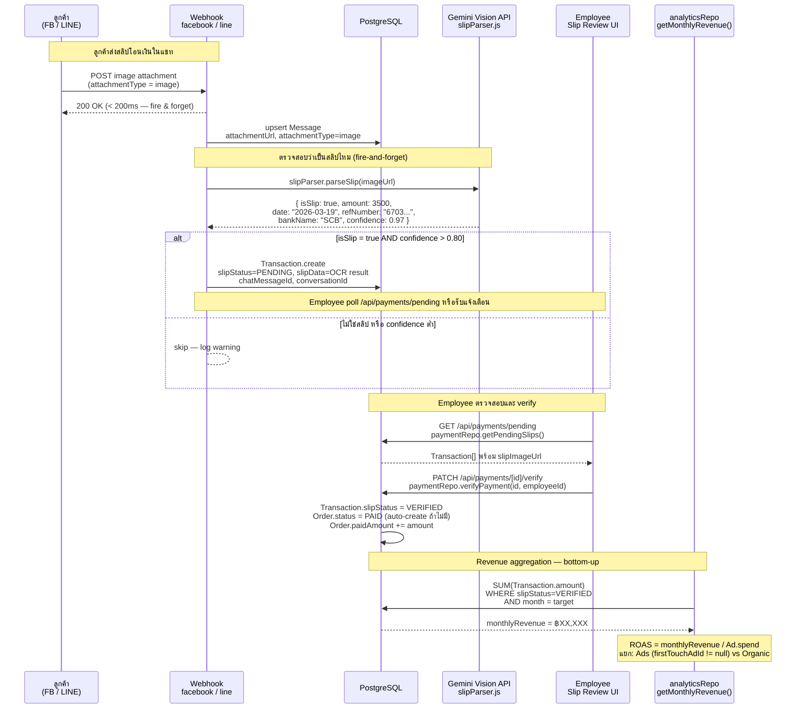
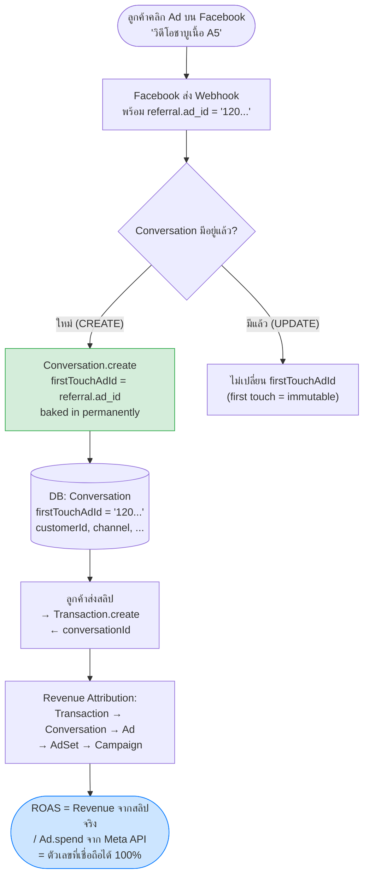
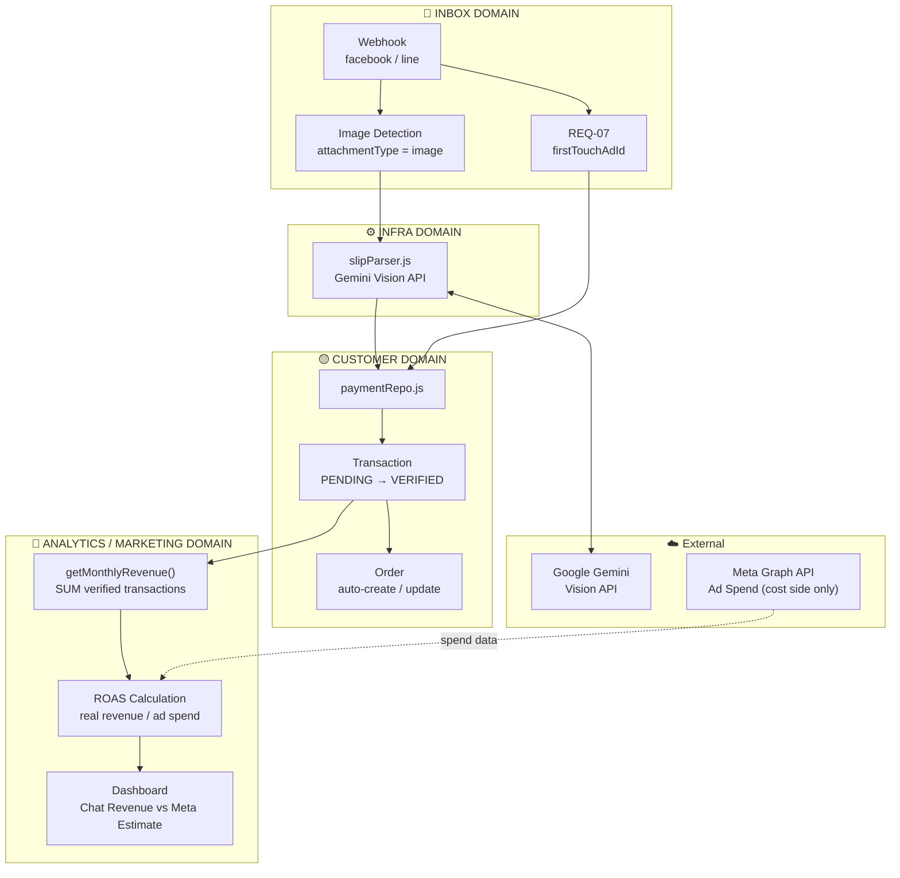

# Domain Data Flow Diagrams — V School CRM v2

Diagram เฉพาะ domain แต่ละส่วน (Mermaid)
อ่านร่วมกับ [`arc42-main.md`](./arc42-main.md) และ [`../overview.md`](../overview.md)

---

## 1. Inbox — Unified FB + LINE Message Flow



---

## 2. Marketing Sync Pipeline — Meta Ads → DB → Cache



---

## 3. Notification Pipeline — Rule Engine → BullMQ → LINE Push



---

## 4. Ad Review Pipeline — Phase A Rules + Phase B Gemini AI


---

## 5. Agent Attribution — Playwright Scraper → DB



---

## 6. Kitchen Stock Deduction — Session Complete → FEFO Lot Deduction



---

## Cross-Domain: Redis Cache Strategy

```mermaid
flowchart LR
    subgraph API Routes
        A[/api/marketing/insights]
        B[/api/inbox/conversations]
        C[/api/analytics/team]
    end

    subgraph Redis getOrSet Pattern
        R[("Upstash Redis<br/>REST API<br/>@upstash/redis")]
    end

    subgraph PostgreSQL
        DB[("Supabase<br/>PostgreSQL")]
    end

    A -->|"key: insights:TIMEFRAME<br/>TTL: 3600s"| R
    B -->|"key: inbox:list:PAGE<br/>TTL: 60s"| R
    C -->|"key: analytics:team:DATE<br/>TTL: 3600s"| R

    R -->|MISS: query| DB
    DB -->|write-through| R

    style R fill:#dc2626,color:#fff
    style DB fill:#2563eb,color:#fff
```

---

---

## 7. Chat-First Revenue Attribution — Slip OCR → Transaction → ROAS (Phase 26)

> **หลักการ:** ใช้สลิปโอนเงินในแชทเป็น source of truth ของ Revenue แทนตัวเลข estimated จาก Meta
> **ADR:** ADR-038 (planned)



---

## 8. REQ-07: First Touch Ad Attribution — Conversation → Ad Link

> **ปัญหา:** Webhook รับ `referral.ad_id` จาก Facebook ได้ แต่ปัจจุบันทิ้งค่านี้ไป (line 155: `{}`)
> **แก้:** บันทึก `firstTouchAdId` ลง Conversation เมื่อสร้างครั้งแรก



---

## Cross-Domain: Chat-First Revenue Domain Map



---

*Last updated: 2026-03-19 — v1.1.0*
*ดูเพิ่มเติม: [overview.md](../overview.md) · [arc42-main.md](./arc42-main.md) · [ADR directory](../adr/)* · [domain-boundaries.md](./domain-boundaries.md)*
