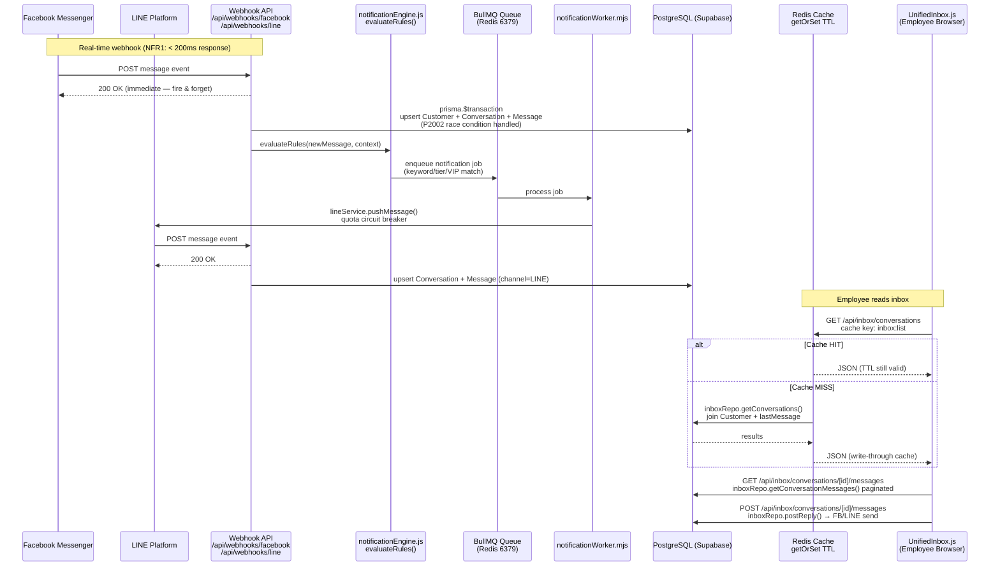
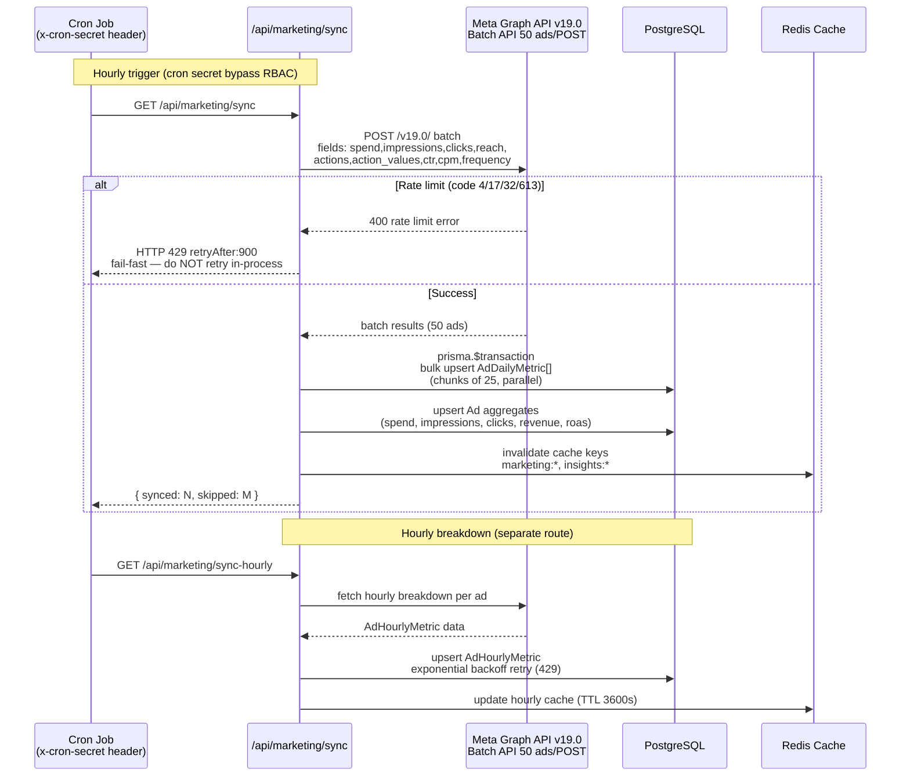
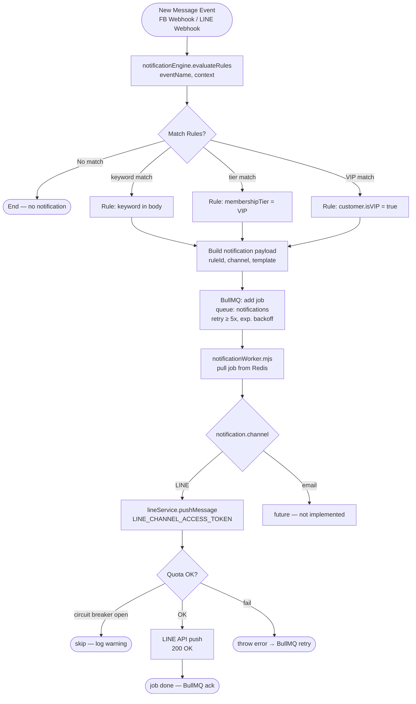
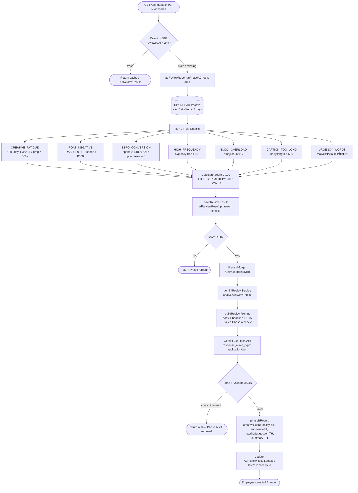
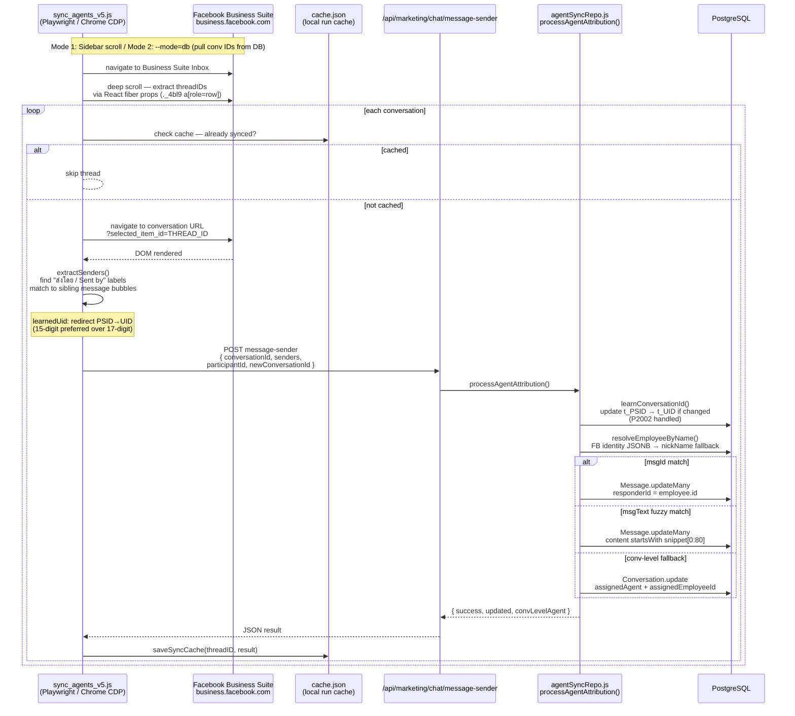

# Domain Data Flow Diagrams — V School CRM v2

Diagram เฉพาะ domain แต่ละส่วน (Mermaid)
อ่านร่วมกับ [`arc42-main.md`](./arc42-main.md) และ [`../overview.md`](../overview.md)

---

## 1. Inbox — Unified FB + LINE Message Flow



---

## 2. Marketing Sync Pipeline — Meta Ads → DB → Cache



---

## 3. Notification Pipeline — Rule Engine → BullMQ → LINE Push



---

## 4. Ad Review Pipeline — Phase A Rules + Phase B Gemini AI



---

## 5. Agent Attribution — Playwright Scraper → DB



---

## 6. Kitchen Stock Deduction — Session Complete → FEFO Lot Deduction

```mermaid
flowchart TD
    A([POST /api/schedules/id/complete\n{ studentCount }]) --> B[scheduleRepo\ncompleteSessionWithStockDeduction]

    B --> C[(DB: CourseSchedule\n→ Product → CourseBOM\n→ RecipeIngredient + RecipeEquipment)]

    C --> D{For each ingredient\nin recipe BOM}

    D --> E[qtyNeeded = RecipeIngredient.qty × studentCount]
    E --> F[(DB: IngredientLot\nstatus=ACTIVE\norderBy expiresAt ASC\nFEFO — First Expired First Out)]

    F --> G{remaining > 0?}
    G -- yes --> H[deduct from lot\nremainingQty -= deduct\nupdate lot status\nCONSUMED if remainingQty = 0]
    H --> I[StockDeductionLog\nwrite: lotId, qtyDeducted]
    I --> G

    G -- no more lots --> J[Ingredient.currentStock -= totalDeducted\nDB update]

    D --> K{For each equipment\nin RecipeEquipment}
    K --> L[qtyRequired per session\nNOT multiplied by studentCount]
    L --> M[Ingredient.currentStock -= qtyRequired\nno lot tracking for equipment]

    J & M --> N[prisma.$transaction\nall-or-nothing commit]
    N --> O([CourseSchedule.status = COMPLETED\nreturn deduction summary])
```

---

## Cross-Domain: Redis Cache Strategy

```mermaid
flowchart LR
    subgraph API Routes
        A[/api/marketing/insights]
        B[/api/inbox/conversations]
        C[/api/analytics/team]
    end

    subgraph Redis getOrSet Pattern
        R[(Redis\nioredis docker\nredis:7-alpine :6379)]
    end

    subgraph PostgreSQL
        DB[(Supabase\nPostgreSQL)]
    end

    A -->|key: insights:TIMEFRAME\nTTL: 3600s| R
    B -->|key: inbox:list:PAGE\nTTL: 60s| R
    C -->|key: analytics:team:DATE\nTTL: 3600s| R

    R -->|MISS: query| DB
    DB -->|write-through| R

    style R fill:#dc2626,color:#fff
    style DB fill:#2563eb,color:#fff
```

---

*Last updated: 2026-03-18 — v0.22.0*
*ดูเพิ่มเติม: [overview.md](../overview.md) · [arc42-main.md](./arc42-main.md) · [ADR directory](../adr/)*
