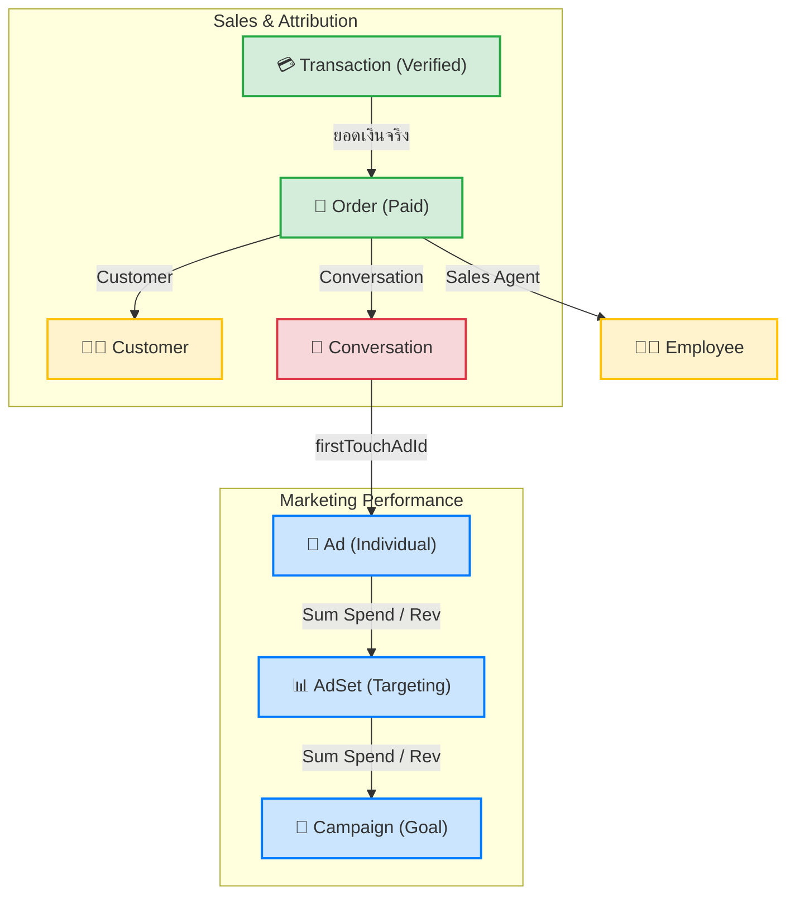

# Revenue Attribution & Ad Analytics Model — V School CRM v2

**Last Updated:** 2026-03-19
**Reference:** `Prisma Schema`, `Ads API Integration`, `paymentRepo.js`

เอกสารนี้รวบรวมโมเดลการจัดสรรรายได้ (Revenue Attribution) และการคำนวณตัวชี้วัดประสิทธิภาพโฆษณา (Ad Analytics) เพื่อให้เห็นภาพการไหลของข้อมูลตั้งแต่ "เงินที่โอนเข้า" ไปจนถึง "ROAS ของแคมเปญ"

---

## 1. ข้อมูลดิบและการคำนวณ (Metrics Logic)

ระบบดึงข้อมูลดิบจาก Meta Graph API และ Database มาคำนวณตามสูตรดังนี้:

| ตัวชี้วัด (Metric) | ความหมาย | สูตรการคำนวณ | ความสำคัญ |
|:---|:---|:---|:---|
| **Spend** | งบที่ใช้ | ดึงตรงจาก Meta API | ต้นทุนฝั่ง Outbound |
| **Revenue** | รายได้จริง | Σ Transaction (slipStatus=VERIFIED) | รายได้ฝั่ง Inbound (Source of Truth) |
| **CPM** | Cost Per 1,000 Imp | `(Spend / Impressions) * 1,000` | วัดความยากง่ายในการเข้าถึงกลุ่มเป้าหมาย |
| **CTR** | Click-Through Rate | `(Clicks / Impressions) * 100` | วัดความน่าสนใจของ Creative |
| **CPC** | Cost Per Click | `Spend / Clicks` | ประสิทธิภาพของการคลิก |
| **ROAS** | Return on Ad Spend | `Revenue / Spend` | **KPI หลัก:** ความคุ้มค่าเชิงธุรกิจ |

---

## 2. แผนภูมิต้นไม้การคำนวณ (Attribution Tree)

ยอดเงิน 1 ก้อนที่ลูกค้าโอนมา จะถูกส่งกลับขึ้นไปคำนวณเป็นยอด ROAS ตามลำดับชั้น:

---

## 3. ลำดับการไหลของข้อมูล (Data Flow Levels)

### Step 1: Ingestion (Bottom-Up)
1. **Raw Metrics:** ระบบดึง Spend, Imp, Click รายชั่วโมง/รายวันจาก Meta มาเก็บไว้ใน `AdHourlyMetric` และ `AdDailyMetric`
2. **Transaction Entry:** เมื่อแอดมิน Verify สลิป รายได้จะถูกบันทึกใน `Transaction` และเชื่อมโยงกับ `Conversation`

### Step 2: Attribution (Linking)
- **REQ-07 (First Touch):** เมื่อลูกค้าทักมาครั้งแรก ระบบจะบันทึก `firstTouchAdId` ลงในห้องแชทถาวร เพื่อให้ยอดขายในอนาคต (LTV) ทั้งหมดไหลกลับไปหา Ad ชิ้นแรกที่เป็นต้นเหตุกว่า 100%

### Step 3: Aggregation (Reporting)
- **Ad Level:** ผลรวมรายได้จากทุก `Transaction` ที่โยงผ่าน `Conversation` มายัง `Ad` ชิ้นนั้นๆ
- **Hierarchical Sum:** Ad → AdSet → Campaign (คำนวณ ROAS ใหม่ทุกระดับชั้นเพื่อให้ได้ตัวเลขที่แม่นยำที่สุด)

---

## 4. หมายเหตุทางเทคนิค (Technical Implementation)

- **Source of Truth:** รายได้ (Revenue) ต้องมาจาก `Transaction` ที่ `slipStatus = 'VERIFIED'` เท่านั้น ไม่ใช้ตัวเลข estimate จาก Meta
- **Immutable Attribution:** `firstTouchAdId` จะถูกตั้งค่าเพียงครั้งเดียวเมื่อสร้าง `Conversation` และจะไม่ถูกทับด้วย Ad อื่นในภายหลัง เพื่อรักษาความแม่นยำของ First-Touch model
- **Cache:** ผลการคำนวณ ROAS ระดับแคมเปญจะถูกเก็บใน Redis Cache (TTL 3600s)

---
*Generated by Antigravity CRM Intelligence*
