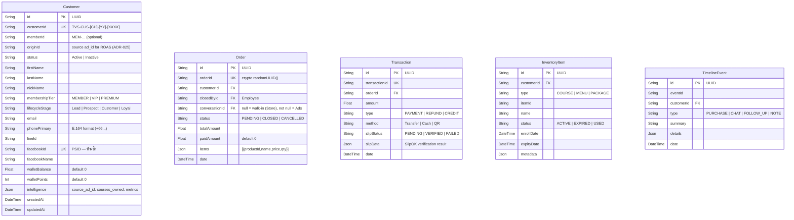
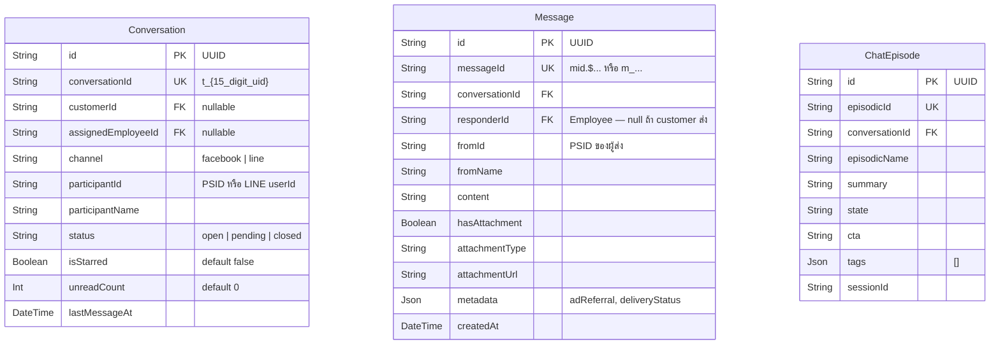
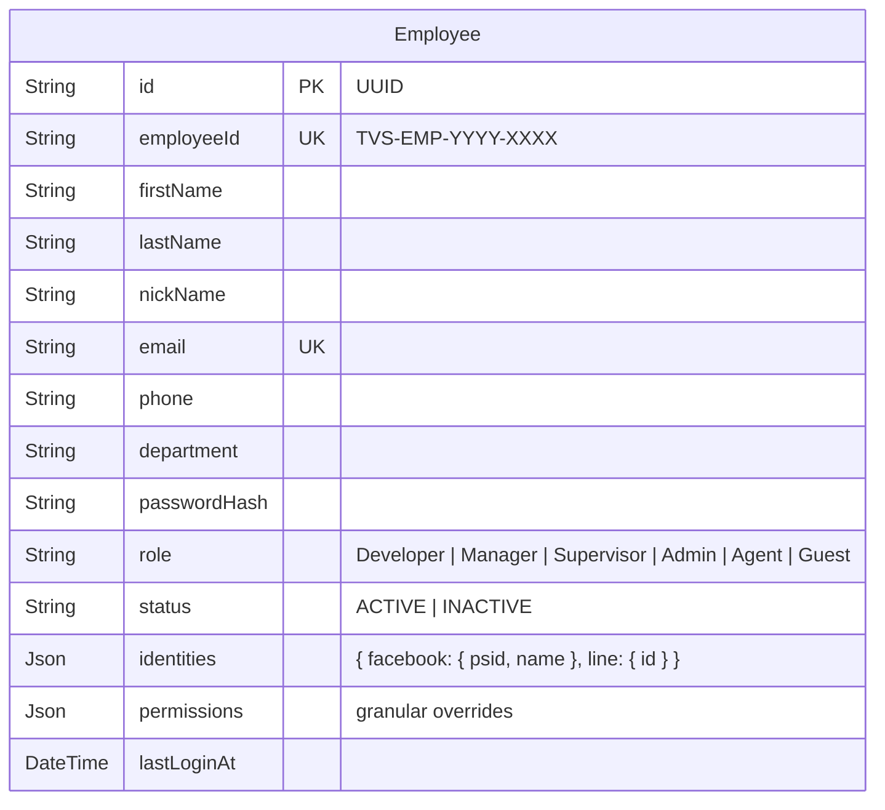
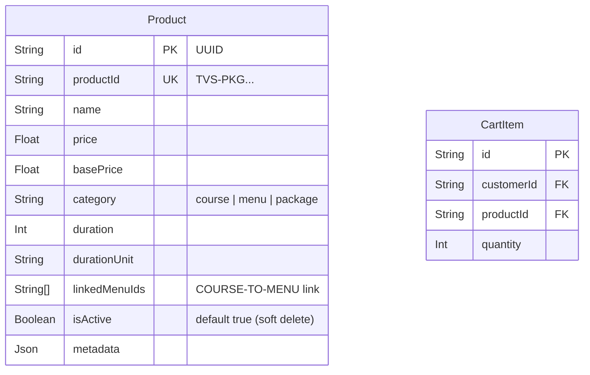
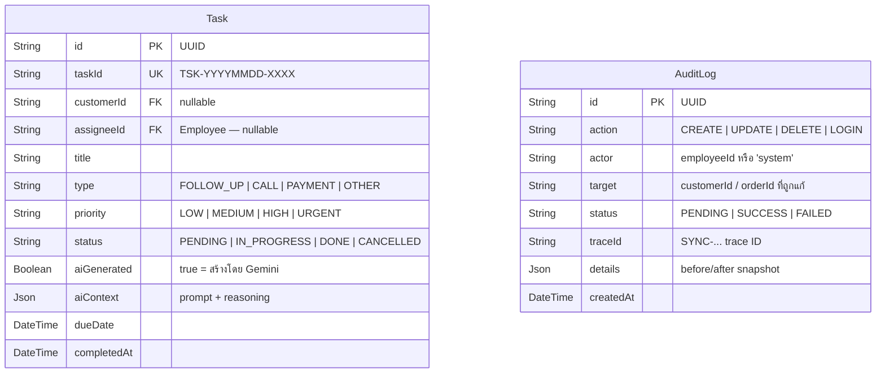
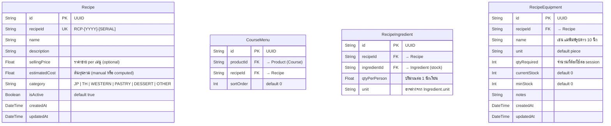

# V School CRM — Entity Relationship Diagram (ERD)

**อัปเดต:** 2026-03-15 (Phase 16)
**อ้างอิง:** `prisma/schema.prisma` (37 models)
**Standard:** Mermaid erDiagram

---

## Full ERD — ทุก Relationship

```mermaid
erDiagram
    %% ═══════════════════════════════
    %% DOMAIN: Customer (Core)
    %% ═══════════════════════════════
    Customer ||--o{ Order          : "สั่งซื้อ"
    Customer ||--o{ Conversation   : "ทักแชท"
    Customer ||--o{ Task           : "มีงานติดตาม"
    Customer ||--o{ CartItem       : "มีของในตะกร้า"
    Customer ||--o{ InventoryItem  : "คอร์สที่ซื้อแล้ว"
    Customer ||--o{ TimelineEvent  : "timeline กิจกรรม"

    %% ═══════════════════════════════
    %% DOMAIN: Conversation
    %% ═══════════════════════════════
    Conversation ||--o{ Message     : "มีข้อความ"
    Conversation ||--o{ ChatEpisode : "แบ่งเป็นตอน"
    Conversation ||--o{ Order       : "นำไปสู่คำสั่งซื้อ (OrderConversation)"

    %% ═══════════════════════════════
    %% DOMAIN: Employee (RBAC)
    %% ═══════════════════════════════
    Employee ||--o{ Message      : "ตอบแชท (MessageResponder)"
    Employee ||--o{ Conversation : "รับผิดชอบ (ConversationAssignee)"
    Employee ||--o{ Order        : "ปิดการขาย (OrderCloser)"
    Employee ||--o{ Task         : "ได้รับมอบหมาย (AgentTasks)"

    %% ═══════════════════════════════
    %% DOMAIN: Order / Sales
    %% ═══════════════════════════════
    Order ||--o{ Transaction : "มีการชำระเงิน"

    %% ═══════════════════════════════
    %% DOMAIN: Product / Cart
    %% ═══════════════════════════════
    Product ||--o{ CartItem : "ถูกเพิ่มในตะกร้า"

    %% ═══════════════════════════════
    %% DOMAIN: Marketing / Ads (ADR-024)
    %% ═══════════════════════════════
    AdAccount ||--o{ Campaign       : "มีแคมเปญ"
    Campaign  ||--o{ AdSet          : "มีชุดโฆษณา"
    AdSet     ||--o{ Ad             : "มีโฆษณา"
    Ad        ||--|{ AdDailyMetric  : "สถิติรายวัน"
    Ad        ||--|{ AdHourlyMetric : "สถิติรายชั่วโมง"
    Ad        ||--|{ AdHourlyLedger : "append-only ledger (ADR-024 D4)"
    Ad        ||--o| AdLiveStatus   : "สถานะ live"
    Ad        }o--o| AdCreative     : "ใช้ creative"
    Ad        }o--o| Experiment     : "อยู่ใน A/B test"

    %% ═══════════════════════════════
    %% DOMAIN: Recipe + Menu (Phase 16)
    %% ═══════════════════════════════
    Recipe       ||--o{ CourseMenu        : "ใช้ในคอร์ส"
    Product      ||--o{ CourseMenu        : "มีเมนูที่สอน"
    Recipe       ||--o{ RecipeIngredient  : "ใช้วัตถุดิบ"
    Ingredient   ||--o{ RecipeIngredient  : "ถูกใช้ใน recipe"
    Recipe       ||--o{ RecipeEquipment   : "ต้องการอุปกรณ์พิเศษ"

    %% ═══════════════════════════════
    %% DOMAIN: Package (Phase 16)
    %% ═══════════════════════════════
    Package           ||--o{ PackageCourse            : "ประกอบด้วยคอร์ส"
    Product           ||--o{ PackageCourse            : "อยู่ใน package"
    Package           ||--o{ PackageGift              : "มีของแถม"
    Package           ||--o{ PackageEnrollment        : "ลูกค้าลงทะเบียน"
    Customer          ||--o{ PackageEnrollment        : "ซื้อ package"
    Employee          ||--o{ PackageEnrollment        : "ปิดการขาย (PackageEnrollmentSeller)"
    PackageEnrollment ||--o{ PackageEnrollmentCourse  : "เลือกคอร์สไว้"
    Product           ||--o{ PackageEnrollmentCourse  : "ถูกเลือก"
```



---

## Entity Blocks — Key Fields

### DOMAIN: Customer



### DOMAIN: Conversation



### DOMAIN: Employee



### DOMAIN: Product / Cart



### DOMAIN: Marketing / Ads (ADR-024)

```mermaid
erDiagram
    AdAccount {
        String  id        PK  "UUID"
        String  accountId UK  "act_XXXXXXXXX"
        String  name
        String  currency      "THB"
    }

    Campaign {
        String  id              PK  "UUID"
        String  campaignId      UK
        String  adAccountId     FK
        String  name
        String  objective
        String  status          "ACTIVE | PAUSED | DELETED"
        Float   fbSpend             "audit snapshot จาก FB API เท่านั้น"
        Float   fbRevenue           "audit snapshot — ไม่ใช้คำนวณ"
        Json    rawData
    }

    AdSet {
        String  id         PK  "UUID"
        String  adSetId    UK
        String  campaignId FK
        String  name
        String  status
        Float   dailyBudget
        Json    targeting
    }

    Ad {
        String  id             PK  "UUID"
        String  adId           UK
        String  adSetId        FK
        String  creativeId     FK  "nullable"
        String  experimentId   FK  "nullable (A/B test)"
        String  name
        String  status
        Float   spend              "Bottom-Up aggregate (ADR-024)"
        Int     impressions
        Int     clicks
        Float   roas
        Float   revenue
        DateTime createdAt         "ใช้ detect creative fatigue (Phase 3)"
    }

    AdDailyMetric {
        String  id          PK
        String  adId        FK  "unique per adId+date"
        DateTime date
        Float   spend
        Int     impressions
        Int     clicks
        Int     leads
        Int     purchases
        Float   revenue
        Float   roas
    }

    AdHourlyLedger {
        String  id    PK
        String  adId  FK  "append-only — ห้าม UPDATE (ADR-024 D4)"
        DateTime date
        Int     hour
        Float   spend
        Float   roas
    }

    AdCreative {
        String  id         PK
        String  creativeId UK
        String  name
        String  headline
        String  body
        String  imageUrl
        String  videoUrl
        String  callToAction
    }

    Experiment {
        String  id             PK
        String  name
        String  status             "RUNNING | CONCLUDED"
        String  hypothesis
        String  winningVariant
        DateTime startDate
        DateTime endDate
    }

    AdLiveStatus {
        String  adId          PK+FK  "1-to-1 กับ Ad"
        Boolean isRunningNow
        DateTime lastImpressionTime
        DateTime updatedAt
    }
```

### DOMAIN: Tasks & Audit



---

## Domain Summary

| Domain | Models | หมายเหตุ |
|---|---|---|
| Customer Core | Customer, Order, Transaction, InventoryItem, TimelineEvent, CartItem | 6 models |
| Conversation | Conversation, Message, ChatEpisode | 3 models |
| Employee / RBAC | Employee | 1 model — ADR-026 6-tier roles |
| Product | Product, CartItem | 2 models (CartItem shared กับ Customer) |
| Marketing / Ads | AdAccount, Campaign, AdSet, Ad, AdDailyMetric, AdHourlyMetric, AdHourlyLedger, AdLiveStatus, AdCreative, Experiment | 10 models — ADR-024 |
| Tasks | Task | 1 model |
| Audit | AuditLog | 1 model |
| **รวม** | **23 models** | |

---

## Key Architecture Decisions

| Decision | ผลต่อ Schema |
|---|---|
| **ADR-024** Bottom-Up Aggregation | Campaign ไม่เก็บ aggregated metrics — คำนวณจาก Ad layer ขึ้นไป |
| **ADR-024 D4** Append-only Ledger | AdHourlyLedger ห้าม UPDATE — insert only เมื่อ delta != 0 |
| **ADR-025** Identity Resolution | Customer เก็บ `facebookId`, `lineId`, `phonePrimary` ทั้งสาม + `originId` สำหรับ ROAS |
| **ADR-026** RBAC | Employee.role = Developer > Manager > Supervisor > Admin > Agent > Guest |
| **ADR-027** UUID PKs | ทุก model ใช้ `@default(uuid())` — ไม่ใช้ CUID หรือ auto-increment |
| **ADR-030** Revenue Split | `Order.conversationId IS NULL` = Store Revenue, `NOT NULL` = Ads Revenue |
| **ADR-033** Unified Inbox | `Conversation.channel` = "facebook" | "line" — ไม่มี field `channel` บน Customer |

---

## DOMAIN: Recipe + Menu (Phase 16)



## DOMAIN: Package (Phase 16)

```mermaid
erDiagram
    Package {
        String  id             PK  "UUID"
        String  packageId      UK  "PKG-[YYYY]-[SERIAL]"
        String  name
        String  description
        Float   originalPrice      "sum ราคาคอร์สทั้งหมด (before discount)"
        Float   packagePrice       "ราคาขายจริง (after discount)"
        Boolean isActive           "default true"
        DateTime createdAt
        DateTime updatedAt
    }

    PackageCourse {
        String  id           PK  "UUID"
        String  packageId    FK
        String  productId    FK
        Boolean isRequired       "true = ต้องเรียน, ห้ามตัดออก"
        Boolean isLocked         "true = ห้าม swap แม้อยู่ใน swapGroup"
        String  swapGroup        "null = ไม่มี swap option, เช่น GROUP_A"
        Int     swapGroupMax     "null = เลือกได้ทั้งหมดในกลุ่ม"
        Int     sortOrder
    }

    PackageGift {
        String  id             PK  "UUID"
        String  packageId      FK
        String  name               "เช่น ผ้ากันเปื้อน V School"
        Int     qty                "default 1"
        Float   estimatedCost      "ต้นทุนของแถม"
        String  notes
    }

    PackageEnrollment {
        String   id             PK  "UUID"
        String   enrollmentId   UK  "PENR-[YYYY]-[SERIAL]"
        String   packageId      FK
        String   customerId     FK
        String   soldById       FK  "Employee (optional)"
        Float    totalPrice
        String   status             "ACTIVE | COMPLETED | CANCELLED"
        DateTime swapUsedAt         "null = ยังไม่ swap, non-null = ใช้สิทธิ์แล้ว (1 ครั้ง)"
        DateTime enrolledAt
        String   notes
    }

    PackageEnrollmentCourse {
        String  id                  PK  "UUID"
        String  packageEnrollmentId FK
        String  productId           FK
        Boolean wasSwapped              "true = เลือกผ่าน swap"
    }
```



---

## Stock Deduction Flow (Phase 16)

```
POST /api/schedules/[id]/complete
      │
      ▼
  CourseSchedule.product
      │
      ▼
  Product.courseMenus[]  ──► CourseMenu ──► Recipe
                                                │
                          ┌─────────────────────┤
                          ▼                     ▼
                  RecipeIngredient[]      RecipeEquipment[]
                  (qty × studentCount)   (qtyRequired, per session)
                          │                     │
                          ▼                     ▼
                  Ingredient.currentStock  RecipeEquipment.currentStock
                  -= total                -= qtyRequired
                          │
                   prisma.$transaction (atomic — all or nothing)
```
