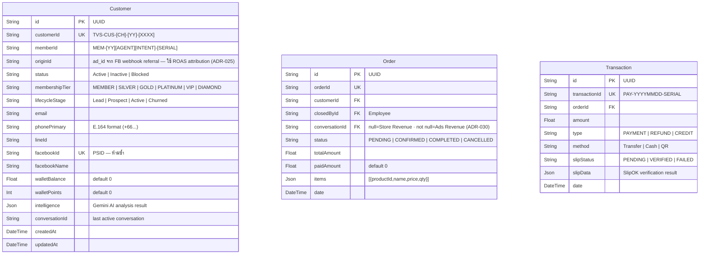
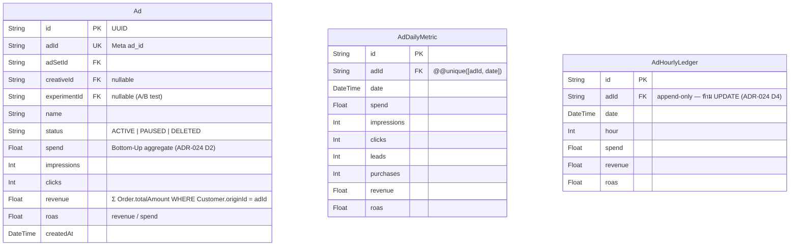
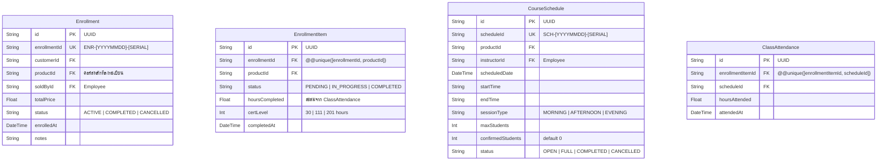
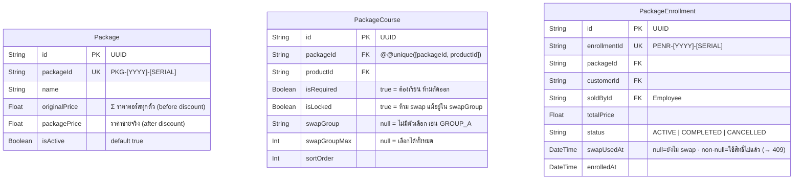
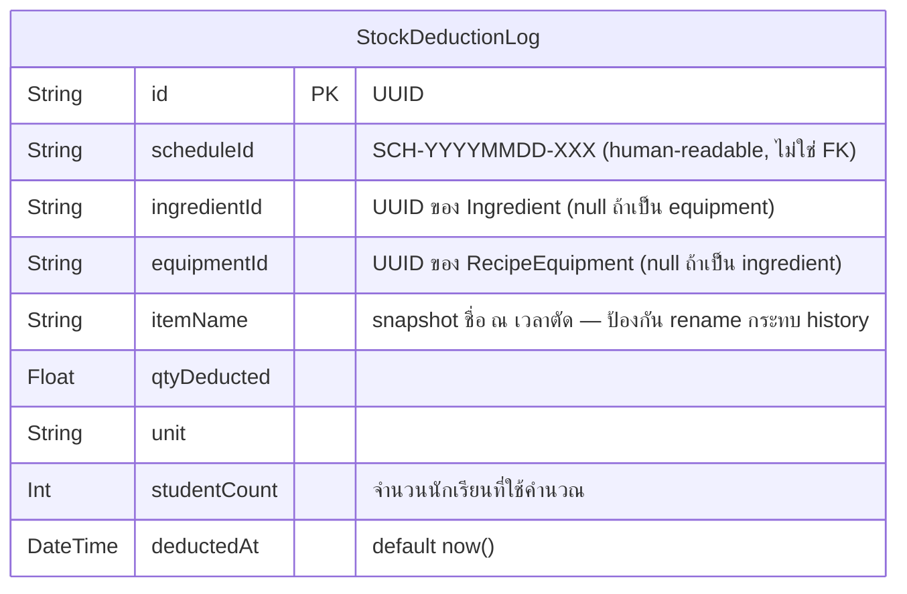

# V School CRM — Entity Relationship Diagram (ERD)

**อัปเดต:** 2026-03-16 (Phase 19)
**อ้างอิง:** `prisma/schema.prisma` (40 models)
**Standard:** Mermaid erDiagram

---

## Full ERD — ทุก Relationship

```mermaid
erDiagram
    %% ═══════════════════════════════
    %% DOMAIN: Customer (Core)
    %% ═══════════════════════════════
    Customer ||--o{ Order             : "สั่งซื้อ"
    Customer ||--o{ Conversation      : "ทักแชท"
    Customer ||--o{ Task              : "มีงานติดตาม"
    Customer ||--o{ CartItem          : "มีของในตะกร้า"
    Customer ||--o{ InventoryItem     : "คอร์สที่ซื้อแล้ว"
    Customer ||--o{ TimelineEvent     : "timeline กิจกรรม"
    Customer ||--o{ Enrollment        : "ลงทะเบียนคอร์ส"
    Customer ||--o{ PackageEnrollment : "ลงทะเบียนแพ็กเกจ"

    %% ═══════════════════════════════
    %% DOMAIN: Conversation
    %% ═══════════════════════════════
    Conversation ||--o{ Message     : "มีข้อความ"
    Conversation ||--o{ ChatEpisode : "แบ่งเป็นตอน (AI)"
    Conversation ||--o{ Order       : "นำไปสู่คำสั่งซื้อ (OrderConversation)"

    %% ═══════════════════════════════
    %% DOMAIN: Employee (RBAC)
    %% ═══════════════════════════════
    Employee ||--o{ Message           : "ตอบแชท (MessageResponder)"
    Employee ||--o{ Conversation      : "รับผิดชอบ (ConversationAssignee)"
    Employee ||--o{ Order             : "ปิดการขาย (OrderCloser)"
    Employee ||--o{ Task              : "ได้รับมอบหมาย (AgentTasks)"
    Employee ||--o{ Enrollment        : "ขายคอร์ส (EnrollmentSeller)"
    Employee ||--o{ CourseSchedule    : "สอน (ScheduleInstructor)"
    Employee ||--o{ PurchaseRequest   : "อนุมัติ (PRApprover)"
    Employee ||--o{ Asset             : "รับผิดชอบอุปกรณ์ (AssetAssignee)"
    Employee ||--o{ PackageEnrollment : "ขายแพ็กเกจ (PackageEnrollmentSeller)"

    %% ═══════════════════════════════
    %% DOMAIN: Order / Sales
    %% ═══════════════════════════════
    Order ||--o{ Transaction : "มีการชำระเงิน"

    %% ═══════════════════════════════
    %% DOMAIN: Product / Cart
    %% ═══════════════════════════════
    Product ||--o{ CartItem              : "ถูกเพิ่มในตะกร้า"
    Product ||--o{ Enrollment            : "ถูกลงทะเบียน"
    Product ||--o{ EnrollmentItem        : "อยู่ใน enrollment"
    Product ||--o{ CourseSchedule        : "มีตารางสอน"
    Product ||--o{ CourseBOM             : "[DEPRECATED] BOM ระดับคอร์ส"
    Product ||--o{ CourseMenu            : "มีเมนูที่สอน"
    Product ||--o{ CourseEquipment       : "มีอุปกรณ์ประจำคอร์ส"
    Product ||--o{ PackageCourse         : "อยู่ใน package"
    Product ||--o{ PackageEnrollmentCourse : "ถูกเลือกใน enrollment"

    %% ═══════════════════════════════
    %% DOMAIN: Marketing / Ads (ADR-024)
    %% ═══════════════════════════════
    AdAccount ||--o{ Campaign        : "มีแคมเปญ"
    Campaign  ||--o{ AdSet           : "มีชุดโฆษณา"
    AdSet     ||--o{ Ad              : "มีโฆษณา"
    Ad        ||--|{ AdDailyMetric   : "สถิติรายวัน"
    Ad        ||--|{ AdHourlyMetric  : "สถิติรายชั่วโมง"
    Ad        ||--|{ AdHourlyLedger  : "append-only ledger (ADR-024 D4)"
    Ad        ||--o| AdLiveStatus    : "สถานะ live"
    Ad        }o--o| AdCreative      : "ใช้ creative"
    Ad        }o--o| Experiment      : "อยู่ใน A/B test"

    %% ═══════════════════════════════
    %% DOMAIN: Enrollment + Schedule (Phase 15)
    %% ═══════════════════════════════
    Enrollment        ||--o{ EnrollmentItem  : "มีรายการคอร์ส"
    EnrollmentItem    ||--o{ ClassAttendance : "มีประวัติเข้าเรียน"
    CourseSchedule    ||--o{ ClassAttendance : "นักเรียนเข้าเรียน session นี้"
    CourseSchedule    ||--o{ PurchaseRequest : "สร้าง PR วัตถุดิบ"

    %% ═══════════════════════════════
    %% DOMAIN: Kitchen Ops (Phase 15)
    %% ═══════════════════════════════
    Ingredient        ||--o{ CourseBOM          : "[DEPRECATED] ใช้ใน course BOM"
    Ingredient        ||--o{ PurchaseRequestItem : "ต้องสั่งซื้อ"
    Ingredient        ||--o{ RecipeIngredient    : "ใช้ใน recipe (MenuBOM)"
    PurchaseRequest   ||--o{ PurchaseRequestItem : "มีรายการสั่งซื้อ"

    %% ═══════════════════════════════
    %% DOMAIN: Recipe + Menu (Phase 16)
    %% ═══════════════════════════════
    Recipe       ||--o{ CourseMenu        : "ใช้ในคอร์ส"
    Recipe       ||--o{ RecipeIngredient  : "ใช้วัตถุดิบ (MenuBOM)"
    Recipe       ||--o{ RecipeEquipment   : "ต้องการอุปกรณ์พิเศษ"

    %% ═══════════════════════════════
    %% DOMAIN: Package (Phase 16)
    %% ═══════════════════════════════
    Package           ||--o{ PackageCourse            : "ประกอบด้วยคอร์ส"
    Package           ||--o{ PackageGift              : "มีของแถม"
    Package           ||--o{ PackageEnrollment        : "ลูกค้าลงทะเบียน"
    PackageEnrollment ||--o{ PackageEnrollmentCourse  : "เลือกคอร์สไว้"

    %% ═══════════════════════════════
    %% DOMAIN: Stock Audit (Phase 19)
    %% ═══════════════════════════════
    %% StockDeductionLog ไม่มี FK relation (append-only, scheduleId เก็บเป็น String ไม่ใช่ UUID)
```



---

## Entity Blocks — Key Fields (อัพเดท Phase 19)

### DOMAIN: Customer



### DOMAIN: Marketing / Ads (ADR-024)



### DOMAIN: Enrollment + Schedule (Phase 15)



### DOMAIN: Kitchen Ops (Phase 15)

```mermaid
erDiagram
    Ingredient {
        String   id            PK  "UUID"
        String   ingredientId  UK  "ING-[YYYY]-[SERIAL]"
        String   name
        String   unit              "กก. | กรัม | ลิตร | มล. | แผ่น | ชิ้น"
        Float    currentStock      "สต็อกปัจจุบัน"
        Float    minStock          "trigger สร้าง PurchaseRequest อัตโนมัติ"
        String   category          "grain | seafood | dry | sauce | meat | dairy | OTHER"
        Float    costPerUnit       "บาทต่อหน่วย"
    }

    PurchaseRequest {
        String   id          PK  "UUID"
        String   requestId   UK  "PR-[YYYYMMDD]-[SERIAL]"
        String   scheduleId  FK  "nullable — auto-generate จาก complete session"
        String   approvedById FK  "Employee"
        String   status          "DRAFT | APPROVED | ORDERED | RECEIVED | CANCELLED"
        String   notes
        DateTime createdAt
    }

    PurchaseRequestItem {
        String   id                 PK
        String   purchaseRequestId  FK  "@@unique([purchaseRequestId, ingredientId])"
        String   ingredientId       FK
        Float    qtyNeeded
        Float    qtyInStock
        Float    qtyToBuy
        String   unit
        Float    estimatedCost
    }

    Asset {
        String   id             PK  "UUID"
        String   assetId        UK  "AST-[CAT3]-[YYYY]-[SERIAL]"
        String   name
        String   category           "KITCHEN | EQUIPMENT | VEHICLE | BUILDING | IT | GENERAL"
        String   status             "ACTIVE | MAINTENANCE | RETIRED"
        String   location
        String   assignedToId   FK  "Employee"
        Float    purchasePrice
        String   vendor
        String   serialNumber
        DateTime warrantyExpiry
        Json     photos             "Array ของ URL/base64 (max 5)"
    }
```



### DOMAIN: Recipe + Menu — MenuBOM (Phase 16 + Phase 19)

```mermaid
erDiagram
    Recipe {
        String   id             PK  "UUID"
        String   recipeId       UK  "RCP-[YYYY]-[SERIAL]"
        String   name
        String   chef               "AOI | FAH | BKK — ตัวย่อเชฟ"
        Float    sellingPrice       "ราคาขายต่อเมนู (reference)"
        Float    estimatedCost      "ต้นทุนรวม (manual หรือ computed)"
        String   category           "JP | TH | WESTERN | PASTRY | DESSERT"
        Boolean  isActive           "default true"
    }

    CourseMenu {
        String   id         PK  "UUID"
        String   productId  FK  "→ Product (Course)"
        String   recipeId   FK  "→ Recipe"
        Int      dayNumber      "default 1 — วันที่ใน multi-day course"
        String   sessionSlot    "MORNING | AFTERNOON | EVENING"
        Int      sortOrder      "default 0"
        %% Phase 19: @@unique([productId, recipeId, dayNumber])
        %% → อนุญาต same recipe ใน Day1 + Day2 ของคอร์สเดียวกัน
    }

    RecipeIngredient {
        String   id               PK  "UUID (= MenuBOM)"
        String   recipeId         FK  "@@unique([recipeId, ingredientId])"
        String   ingredientId     FK
        Float    qtyPerPerson         "ปริมาณต่อ 1 นักเรียน"
        String   unit                 "หน่วยที่ใช้ใน recipe"
        Float    conversionFactor     "default 1 — แปลงหน่วย (Phase 19)"
        %% qty_deducted = qtyPerPerson × students × conversionFactor
    }

    RecipeEquipment {
        String   id            PK  "UUID"
        String   recipeId      FK
        String   name              "เช่น แม่พิมพ์ซูชิ 10 นิ้ว"
        String   unit              "default piece"
        Int      qtyRequired       "ต่อ 1 session (ไม่คูณจำนวนนักเรียน)"
        Int      currentStock      "default 0"
        Int      minStock          "default 0"
    }
```



### DOMAIN: Package (Phase 16)



### DOMAIN: Stock Audit (Phase 19)



---

## Stock Deduction Flow — Updated (Phase 19)

```
POST /api/schedules/[id]/complete
      │
      ▼
  CourseSchedule (scheduleId, confirmedStudents, productId)
      │
      ▼
  Product.courseMenus[]
      │
      ▼
  CourseMenu (dayNumber, sessionSlot, sortOrder)
      │
      ▼
  Recipe
      │
      ├─► RecipeIngredient (MenuBOM)
      │       qty_deducted = qtyPerPerson × students × conversionFactor ← Phase 19
      │       → Ingredient.currentStock -= qty_deducted
      │
      └─► RecipeEquipment
              qty_deducted = qtyRequired (per session, ไม่คูณนักเรียน)
              → RecipeEquipment.currentStock -= qtyRequired
      │
      ▼
  StockDeductionLog.createMany()     ← Phase 19: append-only audit trail
      │
      ▼
  if Ingredient.currentStock < minStock:
      └─► PurchaseRequest.create() + PurchaseRequestItem[]
              status: DRAFT, requestId: PR-YYYYMMDD-SERIAL
      │
      ▼
  CourseSchedule.status = 'COMPLETED'
      │
      └─ prisma.$transaction (atomic — rollback ทั้งหมดถ้า step ใดล้มเหลว)
```

---

## Facebook Ads → Stock Deduction — Attribution Chain

> **คำถามหลัก**: ยอดขายจากโฆษณาไหน? → คอร์สไหน? → ตัดสต็อกอะไร?

```
Facebook Ad (Ad.adId)
      │
      │  ลูกค้าคลิกโฆษณา → ทักแชท Messenger
      ▼
Message.metadata.adReferral.ad_id        ← จาก FB Webhook referral object
      │
      ▼
Customer.originId = ad_id                ← บันทึกครั้งแรกที่ทักมา (ADR-025)
      │
      │  ลูกค้าซื้อคอร์ส
      ▼
Order (conversationId IS NOT NULL)       ← Ads Revenue path (ADR-030)
      │
      ▼
Enrollment → EnrollmentItem
      │
      │  เข้าเรียน
      ▼
CourseSchedule.status = COMPLETED
      │
      ▼
StockDeductionLog                        ← ตัดสต็อกวัตถุดิบ
      │
      ▼
(Attribution Report)
  ROAS per Ad = Σ(Enrollment.totalPrice WHERE Customer.originId = Ad.adId)
              / Ad.spend
```

### ตาราง Attribution Fields

| Field | ที่อยู่ | หน้าที่ |
|---|---|---|
| `Customer.originId` | Customer model | เก็บ `ad_id` ที่พา customer เข้ามา |
| `Message.metadata.adReferral` | Message.metadata JSON | raw referral data จาก FB Webhook |
| `Order.conversationId` | Order model | `null` = Store / `not null` = Ads Revenue |
| `Ad.revenue` | Ad model | Σ revenue ที่ attribute ได้ (Bottom-Up) |
| `AdDailyMetric.revenue` | AdDailyMetric | รายวัน |
| `StockDeductionLog.scheduleId` | StockDeductionLog | โยงกลับไป session → enrollment → customer → originId |

### Query ตัวอย่าง — "Ad นี้ทำให้ตัดสต็อกอะไรบ้าง?"

```sql
SELECT sdl.item_name, SUM(sdl.qty_deducted) as total_deducted, sdl.unit
FROM stock_deduction_logs sdl
JOIN course_schedules cs ON sdl.schedule_id = cs.schedule_id
JOIN enrollments e ON e.product_id = cs.product_id
JOIN customers c ON e.customer_id = c.id
WHERE c.origin_id = :target_ad_id
  AND sdl.deducted_at >= :start_date
GROUP BY sdl.item_name, sdl.unit
ORDER BY total_deducted DESC;
```

---

## Domain Summary (อัพเดท Phase 19)

| Domain | Models | หมายเหตุ |
|---|---|---|
| Customer Core | Customer, Order, Transaction, InventoryItem, TimelineEvent, CartItem | 6 models |
| Conversation | Conversation, Message, ChatEpisode | 3 models |
| Employee / RBAC | Employee | 1 model — ADR-026 6-tier roles |
| Product / Cart | Product, CartItem | 2 models |
| Marketing / Ads | AdAccount, Campaign, AdSet, Ad, AdDailyMetric, AdHourlyMetric, AdHourlyLedger, AdLiveStatus, AdCreative, Experiment | 10 models — ADR-024 |
| Enrollment + Schedule | Enrollment, EnrollmentItem, CourseSchedule, ClassAttendance | 4 models |
| Kitchen Ops | Ingredient, CourseBOM⚠️, PurchaseRequest, PurchaseRequestItem, Asset | 5 models |
| Recipe + Menu | Recipe, CourseMenu, RecipeIngredient, RecipeEquipment, CourseEquipment | 5 models |
| Package | Package, PackageCourse, PackageGift, PackageEnrollment, PackageEnrollmentCourse | 5 models |
| Notification | NotificationRule | 1 model |
| Tasks | Task | 1 model |
| Audit | AuditLog, **StockDeductionLog** | 2 models — Phase 19 |
| **รวม** | **45 models** | ⚠️ CourseBOM deprecated → Phase 20 |

---

## Key Architecture Decisions

| ADR | Decision | ผลต่อ Schema |
|---|---|---|
| **ADR-024** | Bottom-Up Aggregation | Campaign ไม่เก็บ aggregate — คำนวณจาก Ad level ขึ้นไป |
| **ADR-024 D4** | Append-only Ledger | AdHourlyLedger ห้าม UPDATE — insert only เมื่อ delta != 0 |
| **ADR-025** | Identity Resolution | Customer.originId = ad_id จาก webhook referral — ใช้ ROAS attribution |
| **ADR-026** | RBAC | Employee.role hierarchy: Developer > Manager > Supervisor > Admin > Agent > Guest |
| **ADR-027** | UUID PKs | ทุก model ใช้ `@default(uuid())` |
| **ADR-030** | Revenue Split | `Order.conversationId IS NULL` = Store · `NOT NULL` = Ads Revenue |
| **ADR-033** | Unified Inbox | `Conversation.channel` = "facebook" | "line" — ไม่มี field `channel` บน Customer |
| **ADR-035** | CredentialsOnly Auth | Facebook Login ถูกลบออก — ใช้ Email+Password เท่านั้น |
| **ADR-036** | Google Sheets SSOT | master data sync ผ่าน CSV URL (courses/ingredients/BOM/assets) |
| **ADR-037** | Product as Course Catalog | Reuse Product model เป็น course catalog — ไม่สร้าง model ซ้อน |
| **Phase 19** | Multi-Level BOM | RecipeIngredient = MenuBOM (stored) · CourseBOM = computed (deprecated table) |
