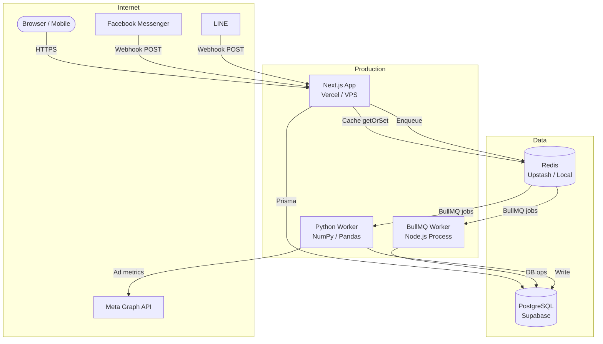

# Deployment Guide — V School CRM v2

---

## Environments

| Environment | URL | Database | Branch |
|---|---|---|---|
| **Local Dev** | http://localhost:3000 | Docker PostgreSQL :5433 | any |
| **Production** | https://crm.vschool.co.th | Supabase PostgreSQL | `master` |

---

## Local Development

ดู [getting-started.md](getting-started.md) สำหรับ full setup

```bash
docker compose up -d
npm run dev          # port 3000
npm run worker       # BullMQ worker (terminal แยก)
```

---

## Production Deployment

### Option A — Vercel (แนะนำ)

```bash
# 1. Install Vercel CLI
npm i -g vercel

# 2. Deploy
vercel --prod

# 3. ตั้ง Environment Variables ใน Vercel Dashboard
# Settings → Environment Variables → เพิ่มทุกตัวจาก .env.example
```

**Environment Variables ที่ต้องตั้งใน Vercel:**
```
DATABASE_URL         = postgresql://...supabase...
NEXTAUTH_SECRET      = (openssl rand -base64 32)
NEXTAUTH_URL         = https://crm.vschool.co.th
FB_PAGE_ACCESS_TOKEN = ...
FB_VERIFY_TOKEN      = ...
GEMINI_API_KEY       = ...
LINE_CHANNEL_ACCESS_TOKEN = ...
```

### Option B — Docker (VPS/Self-hosted)

```bash
# Build
docker build -t vschool-crm:latest .

# Run (ใช้ docker-compose.yml production)
docker compose -f docker-compose.prod.yml up -d
```

**Docker Compose structure (4-stage build):**
```
Stage 1: deps     — npm ci
Stage 2: builder  — next build
Stage 3: migrator — prisma migrate deploy (one-shot, exit 0)
Stage 4: runner   — slim image, node server.js
```

`crm_app` depends on `crm_migrator: service_completed_successfully`

---

## Database Migrations (Production)

```bash
# ตรวจสอบ migration status
npx prisma migrate status

# Deploy migrations (ไม่ reset ข้อมูล)
npx prisma migrate deploy

# Docker: migrator stage รันอัตโนมัติก่อน app start
```

**ห้าม** รัน `prisma migrate reset` บน production — จะลบข้อมูลทั้งหมด

---

## Facebook Webhook Setup

Facebook Webhook ต้องการ HTTPS URL:

```
Webhook URL    : https://crm.vschool.co.th/api/webhooks/facebook
Verify Token   : ค่าใน FB_VERIFY_TOKEN
Subscriptions  : messages, messaging_postbacks, message_reads, feed
```

**Local testing** ใช้ ngrok:
```bash
ngrok http 3000
# Copy HTTPS URL → Meta Developer Console → Webhooks
```

---

## Health Checks

| Endpoint | Expected | หน้าที่ |
|---|---|---|
| `GET /api/customers?limit=1` | `200 OK` | DB connection |
| `GET /api/analytics/executive` | `200 OK` | Analytics + Redis |
| `GET /api/webhooks/facebook?hub.verify_token=...` | `hub.challenge` | FB webhook verify |

---

## Rollback

ดูรายละเอียดเต็มที่ [version-control-and-rollback.md](version-control-and-rollback.md)

```bash
# Rollback to stable (v0.12.0)
git checkout stable
npx prisma migrate deploy
npm run build && npm run start

# หรือ revert last commit
git revert HEAD --no-edit
git push
```

---

## Infrastructure Diagram



---

## Monitoring

- **Logs:** `logger.js` → structured JSON stdout → ดูใน Vercel/VPS logs
- **node-cron jobs:** ดู log `[CRON]` prefix — ถ้า miss execution หมายถึง blocking IO
- **Redis:** `redis-cli ping` → ถ้า PONG = ปกติ
- **DB:** `npx prisma studio` หรือ Supabase Dashboard

---

## Environment Variables Reference

ดู [.env.example](../../.env.example) สำหรับ description ทุก variable
